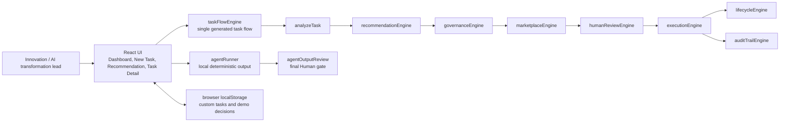

# Human-AgentOS

`Human-AgentOS` is a decision-first workforce control plane that routes knowledge work to a Human, an Agent, or a Hybrid team with visible governance and audit evidence.

## Founder Mode Framing

Teams are moving faster with AI agents, but most organizations still lack a practical operating layer for deciding when agents should be used, when humans should stay accountable, and when a hybrid workflow is safest.

This MVP focuses on one sharp Founder Mode wedge:

`task intake -> Human / Agent / Hybrid recommendation -> governance -> controlled execution -> output review -> audit trail`

The current product is intentionally narrow. It proves the decision and control layer before adding production infrastructure.

## Problem

AI adoption is creating a new management problem:

- leaders cannot consistently decide which work is safe for agents
- sensitive work can be automated too aggressively
- low-risk work can move too slowly through manual review
- agent selection is often disconnected from policy
- output review and audit evidence are usually scattered or missing

Human-AgentOS treats this as an operating-system problem, not just a chat or task-list problem.

## Solution

The demo lets an Innovation / AI transformation lead:

- submit or choose a knowledge-work task
- see a deterministic Human / Agent / Hybrid recommendation
- understand the main reasons and alternatives
- apply governance before launch
- select an eligible execution option from a curated sample marketplace
- run controlled local Agent output only when allowed
- record a Human output review decision
- inspect lifecycle and audit trail evidence

## Demo Flow

Use the built-in scenarios to show the product is not blindly agent-first:

1. `task_001` proves an approved Agent path for clear, low-risk internal research.
2. `task_002` proves a Hybrid path where Human review gates leadership-facing work.
3. `task_003` proves a Blocked path where governance stops unsafe external work.

Recommended click path:

1. Open `Dashboard`.
2. Click `New Task`.
3. Choose a demo scenario.
4. Click `Analyze Task`.
5. Review `Recommendation Result`.
6. Click `Continue to Detail`.
7. On approved Agent work, click `Run demo agent`.
8. After output exists, choose `Accept output`, `Request revision`, or `Reroute to Human`.

## Hackathon Evidence

- [Executive Briefing](docs/15_EXECUTIVE_BRIEFING.md)
- [Architecture](docs/12_ARCHITECTURE.md)
- [Domain model](docs/13_DOMAIN_MODEL.md)
- [Hackathon Benchmark Alignment](docs/16_HACKATHON_BENCHMARK_ALIGNMENT.md)
- [Production Contracts](docs/17_PRODUCTION_CONTRACTS.md)
- [Live Test Plan](docs/18_LIVE_TEST_PLAN.md)
- [Demo Script](docs/14_DEMO_SCRIPT.md)

## Architecture



For more detail, see [docs/12_ARCHITECTURE.md](docs/12_ARCHITECTURE.md).

## Current MVP Boundary

This repository is a frontend-only MVP demo:

- React + Vite app in `app/`
- deterministic local JavaScript logic
- hardcoded demo tasks, policy rules, marketplace profiles, lifecycle, and audit data
- browser `localStorage` for local custom tasks and demo review decisions
- static build output in `app/dist`

It does not include:

- backend
- APIs
- authentication
- database
- queues
- live model calls
- external agent providers
- production observability

That boundary is intentional. The goal is to prove the workflow before adding infrastructure.

## Tech Stack

- React
- Vite
- Tailwind CSS
- Plain JavaScript data and logic modules
- Node-based scenario validator
- Playwright browser E2E tests for judge workflows
- Browser `localStorage` for demo-only local state

## Setup Commands

Install dependencies:

```bash
npm.cmd --prefix app install
```

Start the local dev server:

```bash
npm.cmd --prefix app run dev -- --host 127.0.0.1
```

Open the Vite URL printed in the terminal, usually:

```text
http://127.0.0.1:5173
```

If you are not on Windows, use `npm` instead of `npm.cmd`.

## Validation Commands

Run these before handing off or presenting:

```bash
npm.cmd --prefix app run build
npm.cmd --prefix app run validate:scenarios
```

The scenario validator should end with:

```text
Result: 11/11 scenarios passed
```

Optional technical verification for the main browser workflows:

```bash
npm.cmd --prefix app run test:e2e
```

The E2E command starts the Vite app through Playwright and checks the Dashboard
empty-state behavior, `task_001` Agent flow, `task_002` Hybrid review gate,
`task_003` blocked path, and local demo state reset.

Optional local static preview:

```bash
npm.cmd --prefix app run preview -- --host 127.0.0.1
```

## Demo Scenarios

| Task | Path | Governance | What it proves |
|---|---|---|---|
| `task_001` | Agent | Approved for launch | Clear internal research can use a trusted Agent. |
| `task_002` | Hybrid | Needs human review | An Agent can draft while a Human controls launch. |
| `task_003` | Human | Blocked | Sensitive external work is stopped by policy. |
| `task_004` | Human | Needs human review | High-judgment strategy work stays Human-led. |
| `task_005` | Hybrid | Needs human review | Policy review can use Agent help with Human validation. |

Scenario examples:

- [examples/task_001_agent_path.md](examples/task_001_agent_path.md)
- [examples/task_002_hybrid_review.md](examples/task_002_hybrid_review.md)
- [examples/task_003_blocked_policy.md](examples/task_003_blocked_policy.md)

## Project Docs

- [Product spec](docs/00_PRODUCT_SPEC.md)
- [MVP build plan](docs/01_MVP_BUILD_PLAN.md)
- [UI screen spec](docs/06_UI_SCREENS.md)
- [Demo data guide](docs/07_DEMO_DATA.md)
- [Demo walkthrough](docs/08_DEMO_WALKTHROUGH.md)
- [Deployment guide](docs/09_DEPLOYMENT.md)
- [QA notes](docs/10_QA_NOTES.md)
- [Submission package](docs/11_SUBMISSION_PACKAGE.md)
- [Architecture](docs/12_ARCHITECTURE.md)
- [Domain model](docs/13_DOMAIN_MODEL.md)
- [Demo script](docs/14_DEMO_SCRIPT.md)
- [Executive briefing](docs/15_EXECUTIVE_BRIEFING.md)
- [Hackathon benchmark alignment](docs/16_HACKATHON_BENCHMARK_ALIGNMENT.md)
- [Production contracts](docs/17_PRODUCTION_CONTRACTS.md)
- [Live test plan](docs/18_LIVE_TEST_PLAN.md)

## Production Roadmap

Near-term production steps after the demo:

1. Add a backend API for tasks, recommendations, approvals, execution records, and audit events.
2. Add durable database storage so task history is shared across users and browsers.
3. Add provider adapters for real agent/model execution behind server-side credentials.
4. Add queue-based execution for long-running agent work.
5. Add authentication and role-based approval permissions.
6. Add organization-specific governance policy configuration.
7. Add observability for recommendation decisions, provider runs, policy blocks, latency, failures, and audit integrity.
8. Expand outcome analytics to compare recommended path, selected path, and final result quality.

The product should keep the same core promise as it scales: trusted routing, explainable governance, controlled execution, and reviewable evidence.
