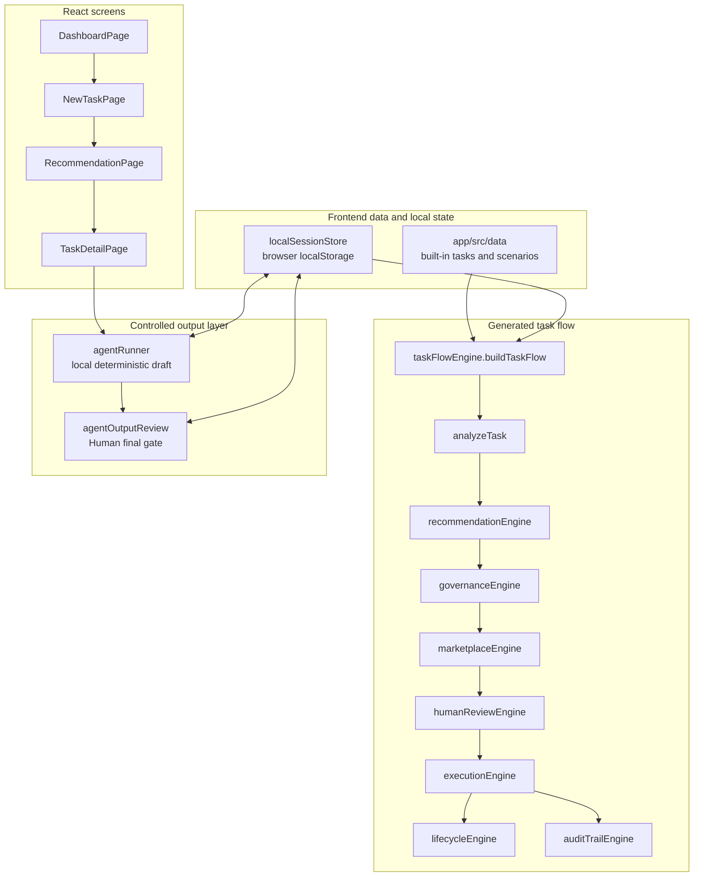

# 12_ARCHITECTURE.md

## Purpose

This document explains the current `SymbiontOS` architecture from a repository and product point of view.

The current app is a frontend-only MVP. It proves the workflow and control-plane idea without adding backend infrastructure, APIs, auth, databases, queues, dependencies, or live model calls.

## Architecture Summary

SymbiontOS is a React + Vite single-page app. The important product logic lives in plain JavaScript modules under `app/src/logic`.

The central idea is simple:

`Task` goes in, `buildTaskFlow(...)` produces the complete demo state that the screens render.

That generated state includes:

- task analysis
- Human / Agent / Hybrid recommendation
- recommendation explanation
- governance result
- eligible execution options
- Human review state
- execution record
- outcome review
- lifecycle steps
- audit events

The UI does not call a backend. Built-in demo tasks live in source-controlled data files, and local user-created demo state is stored only in browser `localStorage`.

## Frontend-Only Boundary

Current implementation:

- React renders the app screens.
- Vite builds the static frontend.
- Tailwind CSS handles styling.
- JavaScript modules generate deterministic recommendation and governance behavior.
- Browser `localStorage` stores demo-only custom tasks, Human review decisions, Agent run outputs, and Agent output review decisions.
- The scenario validator runs task-flow logic directly in Node.

Current non-goals:

- no backend API
- no database
- no authentication
- no server-side policy store
- no queue worker
- no real external agent execution
- no live model provider calls
- no production observability pipeline

## Task Flow

The user-facing flow is:

1. User starts on `Dashboard`.
2. User clicks `New Task`.
3. User chooses a demo scenario or enters a local custom task.
4. User clicks `Analyze Task`.
5. `Recommendation Result` shows analysis, recommendation, explanation, governance, and selected option.
6. User clicks `Continue to Detail`.
7. `Task Detail` shows the full control-plane record.
8. If Human review is required, the user can approve, reroute, or block execution.
9. If an Agent path is launched, the user can click `Run demo agent`.
10. After Agent output exists, the user can accept output, request revision, or reroute final execution to Human.
11. Lifecycle and audit trail update to show the decision history.

## Mermaid Diagram



## Engines And Modules

### `taskFlowEngine.js`

This is the orchestrator. It calls the smaller logic modules in order and returns one object that pages can render.

Beginner-friendly explanation: this file is the assembly line. It takes a task and builds the full story for that task.

### `analyzeTask.js`

Creates structured task attributes such as task type, clarity, judgment, sensitivity, risk, speed pressure, and cost pressure.

This keeps the recommendation logic from guessing directly from long text.

### `recommendationEngine.js`

Scores Human, Agent, and Hybrid fit. It returns a recommendation, confidence value, fit scores, reasons, conditions, and alternatives.

This is deterministic and explainable. There is no model call.

### `governanceEngine.js`

Applies policy rules after the recommendation. It decides whether the task is `approved_for_launch`, `needs_human_review`, or `blocked`.

It also returns allowed paths, blocked paths, policy flags, and policy reasons.

### `marketplaceEngine.js`

Builds execution options from curated sample profiles. Options can be Agent, Human, or Hybrid.

The engine ranks options by task fit, governance eligibility, sensitivity suitability, and recommended path.

### `humanReviewEngine.js`

Creates Human review actions when governance requires a person to approve, reroute, or block a task.

It also resolves the final selected option after a Human review decision.

### `executionEngine.js`

Creates the execution record and lightweight demo outcome. It separates what the system recommended from what actually launched.

Blocked and pending-review tasks do not get completed outcomes.

### `lifecycleEngine.js`

Builds the visible lifecycle state for Task Detail. This is the step-by-step operational view.

### `auditTrailEngine.js`

Builds the audit event list. It records what the system did and what a Human reviewer did.

### `agentRunner.js`

Adds the controlled Agent Runner. It only creates deterministic local demo output after the task is allowed to launch.

It never calls a live model provider.

### `agentOutputReview.js`

Adds the final Human output review gate after a valid Agent run exists.

The supported decisions are:

- `Accept output`
- `Request revision`
- `Reroute to Human`

## Local State

`localSessionStore.js` wraps browser `localStorage`.

It stores:

- local custom tasks
- Human review decisions
- Agent run results
- Agent output review decisions

This is prototype convenience only. It is not durable shared storage, and it is not used by the scenario validator.

## Scenario Validation

The validator lives in:

- `app/src/logic/validateDemoScenarios.js`
- `app/scripts/validateScenarios.mjs`

Run it with:

```bash
npm.cmd --prefix app run validate:scenarios
```

The expected result is:

```text
Result: 11/11 scenarios passed
```

The validator protects the deterministic demo scenarios and Human review decision cases.

## Where Production Pieces Fit Later

The current frontend already shows the places where production infrastructure would fit.

### Backend API

Future backend API routes would sit between the React UI and the task-flow engines.

Likely API responsibilities:

- create and update tasks
- generate recommendations
- evaluate governance
- save Human review decisions
- launch executions
- save Agent output and output review decisions
- return lifecycle and audit history

The frontend should keep the same visible flow.

### Database

A database would replace hardcoded demo data and browser-only `localStorage`.

Likely stored records:

- tasks
- recommendation records
- governance results
- Human review decisions
- execution options selected by users
- execution records
- Agent run results
- Agent output review decisions
- lifecycle events or generated lifecycle state
- audit events

### Queue

A queue would be useful once Agent runs are real and may take longer than a page interaction.

Example queue jobs:

- run external Agent provider
- poll external tool status
- retry failed execution
- generate structured output review package
- emit audit events

### Provider Adapter

Provider adapters should live behind the backend, not in the browser.

They would handle:

- OpenAI or other model calls
- third-party agent provider calls
- credentials and secrets
- provider-specific request/response formats
- safety checks before and after execution

The frontend Agent Runner would become a real execution view, but the governance and Human review gates should remain.

### Observability

Production observability should track the control-plane behavior:

- recommendation path and confidence
- governance status and policy reason
- selected option
- launch status
- provider latency and errors
- queue job status
- output review decision
- audit event integrity

The goal is not only uptime. The goal is proving that agentic work is routed, governed, executed, and reviewed in a way leaders can trust.

## Architecture Principle

Keep the product boundary clear:

`SymbiontOS` owns decisioning, governance, selection, controlled launch, output review, lifecycle, and audit evidence.

It should not become a full HR platform, full project management system, open agent marketplace, broad workflow automation suite, or complex enterprise compliance product in V1.
