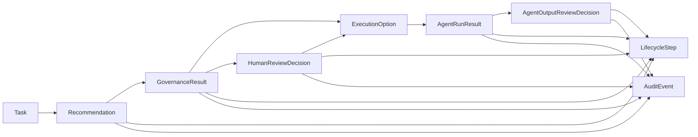

# 13_DOMAIN_MODEL.md

## Purpose

This document defines the main domain objects used by the current `Human-AgentOS` MVP.

It is a tighter reference than `docs/03_DATA_MODEL.md`. The older data-model doc explains the beginner build plan. This file explains the implemented product nouns a reviewer should understand from the repo.

## Object Flow



## 1. Task

`Task` is the work request.

Source:

- built-in examples in `app/src/data/tasks.js`
- local custom tasks created in `app/src/logic/localSessionStore.js`

Important fields:

- `id`
- `title`
- `description`
- `expectedOutput`
- `deadline`
- `audience`
- `sensitivity`
- `urgency`
- `budgetRange`
- `status`
- `source`
- `createdAt`

Example:

```json
{
  "id": "task_001",
  "title": "Create internal market research brief about AI competitors",
  "expectedOutput": "2-page internal research brief",
  "audience": "internal",
  "sensitivity": "low",
  "urgency": "medium",
  "budgetRange": "low",
  "status": "completed",
  "source": "demo"
}
```

Notes:

- `source: "demo"` means source-controlled sample data.
- `source: "local"` means browser-local demo state.
- Local tasks are not shared across users or browsers.

## 2. Recommendation

`Recommendation` is the system routing answer: Human, Agent, or Hybrid.

In code this is currently shaped as a recommendation record from `recommendationEngine.js`.

Important fields:

- `taskId`
- `humanFitScore`
- `agentFitScore`
- `hybridFitScore`
- `recommendedPath`
- `confidence`
- `createdAt`

Path values:

- `human`
- `agent`
- `hybrid`

Example:

```json
{
  "taskId": "task_001",
  "humanFitScore": 45,
  "agentFitScore": 82,
  "hybridFitScore": 67,
  "recommendedPath": "agent",
  "confidence": 85
}
```

Related explanation object:

- `topReasons`
- `keyFactors`
- `alternatives`
- `conditions`

The explanation exists so the product can show why the route was chosen.

## 3. GovernanceResult

`GovernanceResult` is the policy decision after recommendation.

Source:

- `app/src/logic/governanceEngine.js`

Important fields:

- `taskId`
- `recommendedPath`
- `approvalRequired`
- `approvalReason`
- `approvalReasons`
- `allowedPaths`
- `blockedPaths`
- `policyFlags`
- `selectedOptionAllowed`
- `selectedOptionBlockReason`
- `status`
- `policyReason`

Status values:

- `approved_for_launch`
- `needs_human_review`
- `blocked`

Example:

```json
{
  "taskId": "task_002",
  "recommendedPath": "hybrid",
  "approvalRequired": true,
  "allowedPaths": ["human", "agent", "hybrid"],
  "blockedPaths": [],
  "status": "needs_human_review",
  "policyReason": "Task contains medium or high sensitivity content"
}
```

Notes:

- Governance can approve, pause, or block work.
- A recommendation is not the same as permission to launch.

## 4. HumanReviewDecision

`HumanReviewDecision` records what a Human reviewer chose when governance requires review.

Source:

- `app/src/logic/humanReviewEngine.js`
- stored locally through `localSessionStore.js`

Supported action values:

- `approve_recommended`
- `switch_to_human`
- `block_execution`
- `confirm_policy_block`

Important fields:

- `id`
- `taskId`
- `action`
- `label`
- `decisionStatus`
- `selectedPath`
- `selectedOptionId`
- `selectedOptionName`
- `actorName`
- `actorRole`
- `decidedAt`
- `reason`

Example:

```json
{
  "id": "review_task_002_approve_recommended",
  "taskId": "task_002",
  "action": "approve_recommended",
  "decisionStatus": "approved",
  "selectedPath": "hybrid",
  "selectedOptionName": "Executive Memo Agent + Human Reviewer",
  "actorName": "Maya Chen",
  "actorRole": "AI Transformation Lead"
}
```

Notes:

- This is separate from governance.
- Governance says what policy requires.
- Human review records what the user decided.

## 5. ExecutionOption

`ExecutionOption` is a selectable way to do the work after recommendation and governance.

In earlier docs this is also called `MarketplaceOption`.

Source:

- `app/src/logic/marketplaceEngine.js`

Important fields:

- `id`
- `taskId`
- `sourceType`
- `sourceId`
- `displayName`
- `pathType`
- `trustTier`
- `sensitiveDataSuitability`
- `supportedTaskTypes`
- `fitScore`
- `eligible`
- `approvalRequired`
- `whyShown`
- `whyLimited`

Source types:

- `agent`
- `human_role`

Path types:

- `human`
- `agent`
- `hybrid`

Example:

```json
{
  "id": "task_001_agent_001",
  "taskId": "task_001",
  "sourceType": "agent",
  "sourceId": "agent_001",
  "displayName": "Research Analyst Agent",
  "pathType": "agent",
  "trustTier": "trusted",
  "fitScore": 94,
  "eligible": true
}
```

Notes:

- Execution options are generated from curated sample profiles.
- In production, these would likely come from a database-backed capability profile service.

## 6. AgentRunResult

`AgentRunResult` is the controlled local Agent output record.

Source:

- `app/src/logic/agentRunner.js`
- stored locally through `localSessionStore.js`

Important fields:

- `id`
- `taskId`
- `executionId`
- `optionId`
- `runnerName`
- `runMode`
- `status`
- `generatedAt`
- `confidence`
- `steps`
- `output`

Output fields:

- `title`
- `draft`
- `assumptions`
- `risks`
- `reviewChecklist`
- `limitations`

Example:

```json
{
  "id": "agent_run_task_001_agent_001_v1",
  "taskId": "task_001",
  "runnerName": "Research Analyst Agent",
  "runMode": "local_deterministic",
  "status": "completed",
  "confidence": 90
}
```

Notes:

- This is not a live model response.
- It is deterministic local demo output.
- Blocked work and Human-led work do not expose Agent output controls.

## 7. AgentOutputReviewDecision

`AgentOutputReviewDecision` records the final Human gate after Agent output exists.

Source:

- `app/src/logic/agentOutputReview.js`
- stored locally through `localSessionStore.js`

Supported actions:

- `accept_output`
- `request_revision`
- `reroute_to_human`

Important fields:

- `taskId`
- `action`
- `agentRunId`
- `actorName`
- `decidedAt`

Derived summary fields:

- `label`
- `decisionStatus`
- `finalState`
- `description`
- `stateDescription`
- `lifecycleDescription`
- `auditDescription`

Example:

```json
{
  "taskId": "task_001",
  "action": "accept_output",
  "agentRunId": "agent_run_task_001_agent_001_v1",
  "actorName": "Jordan Lee",
  "decidedAt": "2026-07-03T11:30:00Z"
}
```

Decision status values:

- `accepted_for_use`
- `needs_revision`
- `rerouted_to_human`

Notes:

- Output review actions appear only after a valid Agent run exists for the current task flow.
- Requesting revision does not automatically regenerate output.

## 8. LifecycleStep

`LifecycleStep` is one visible step in the Task Detail lifecycle.

Source:

- `app/src/logic/lifecycleEngine.js`
- extended by `agentRunner.js` and `agentOutputReview.js`

Important fields:

- `id`
- `label`
- `description`
- `status`

Example:

```json
{
  "id": "agent_output_review",
  "label": "Agent output review",
  "description": "Jordan Lee recorded: Human accepted the Agent output for use after review.",
  "status": "accepted_for_use"
}
```

Common lifecycle concepts:

- `recommended`
- `approved`
- `needs_human_review`
- `blocked`
- `selected`
- `launched`
- `in_progress`
- `completed`
- `reviewed`
- `agent_output_ready`
- `accepted_for_use`
- `needs_revision`
- `rerouted_to_human`

Notes:

- Lifecycle is generated for display.
- It helps the user see where the task is now.

## 9. AuditEvent

`AuditEvent` is one evidence entry in the audit trail.

Source:

- `app/src/logic/auditTrailEngine.js`
- extended by `agentRunner.js` and `agentOutputReview.js`

Important fields:

- `id`
- `label`
- `description`
- `actorType`
- `relativeTimestamp`
- `status`

Actor types:

- `human`
- `system`
- `agent`

Example:

```json
{
  "id": "task_001_audit_011_agent_runner_completed",
  "label": "Demo agent run completed",
  "description": "Research Analyst Agent generated local demo output agent_run_task_001_agent_001_v1.",
  "actorType": "agent",
  "relativeTimestamp": "T+25m",
  "status": "completed"
}
```

Notes:

- Audit events are the product evidence layer.
- They show what happened, who or what did it, and why the task reached its current state.

## Storage Boundary

Built-in demo objects are source-controlled.

Local objects are stored only in browser `localStorage`:

- local custom tasks
- Human review decisions
- Agent run results
- Agent output review decisions

No current domain object is stored in a backend database.

## Production Mapping

Likely future database-backed objects:

- `Task`
- `Recommendation`
- `GovernanceResult`
- `HumanReviewDecision`
- `ExecutionOption` selection
- `AgentRunResult`
- `AgentOutputReviewDecision`
- `AuditEvent`

Likely generated or derived objects:

- `LifecycleStep`
- ranked `ExecutionOption` lists
- recommendation explanations

The important product rule is to keep recommendation, governance, execution, output review, and audit as separate concepts. That separation is what makes the system explainable.
