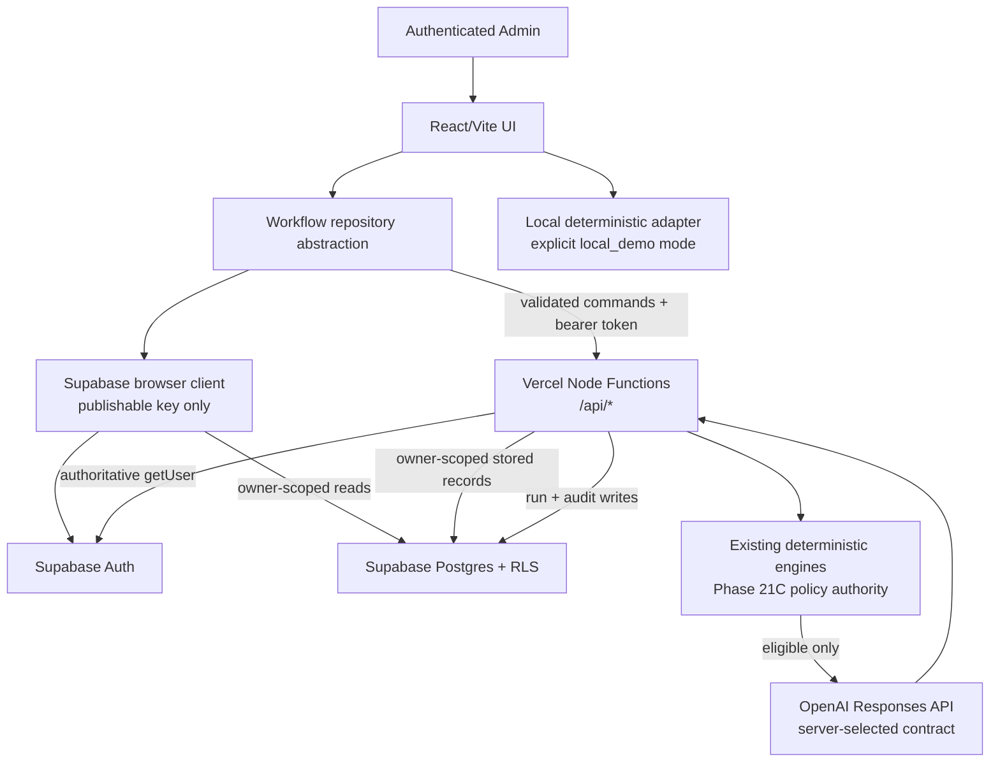

# Phase 22: Single-Admin Full-Stack Governed Agent Implementation Plan

> **For agentic workers:** implement this plan one subphase at a time. Use a fresh branch for each accepted subphase, keep the checklist state in the review package, and do not start the next subphase until the current subphase has passed Codex verification and independent Claude Code review.

**Goal:** transform the Phase 21C browser-local MVP into a deliberately narrow, authenticated, durable full-stack prototype with one governed real Agent path while preserving deterministic Human-AgentOS policy authority and the reliable local demo runner.

**Architecture:** keep the existing React/Vite UI and deterministic engines. Add Supabase Auth and Postgres, explicit RLS, server-validated persistence commands, and Vercel Node Functions at the deployment project's `/api/*` URL boundary. The server must load stored task and Human-decision records, rebuild execution eligibility with the deterministic engines, and only then call one server-side OpenAI Responses API adapter.

**Tech stack:** React 19, Vite 8, plain JavaScript/ES modules, Supabase Auth, Supabase Postgres, Row Level Security, Vercel Node Functions, OpenAI Responses API, Node's built-in test runner, Supabase CLI/pgTAP, and the existing Playwright suite.

## Document status

- This is the single source-of-truth implementation plan for Phase 22.
- Phase 21C is the current merged baseline and must not be renamed, overwritten, reinterpreted, or regressed.
- This document plans Phase 22A through Phase 22I. It does not implement any subphase.
- The current task is documentation-only. No authentication, database, API, environment, dependency, migration, UI, provider, test, screenshot, or deployment behavior is changed by this file.
- Each subphase is an independent review and rollback boundary.

## Global constraints

1. Deterministic Human-AgentOS code remains the policy authority for task analysis, Human/Agent/Hybrid recommendation, governance, blocked state, Human review requirements, launch eligibility, final Human approval, and audit policy.
2. The Router-Worker workflow added in Phase 21C remains part of the controlled execution record. Phase 22 persists and enforces it; it does not replace it with a chatbot.
3. A model never selects a route, approves itself, overrides a block, removes review, marks output finally approved, edits audit history, or chooses browser-supplied prompts, models, providers, or tools.
4. The browser never supplies authoritative recommendation, governance, selected path, launch state, prompt, model, or tool permissions to a live-run endpoint.
5. The backend never trusts a governance snapshot received from the browser. Policy-bearing snapshots are generated by server-owned deterministic code.
6. Before a provider call, the backend authenticates the user, loads owner-scoped stored records, rebuilds eligibility, validates the current execution ID, and rejects stale or conflicting state.
7. Blocked and pending-review work must produce no provider call and no orphaned `running` record.
8. OpenAI and Supabase secret credentials remain server-only. No secret uses a `VITE_` prefix or appears in browser code, API responses, localStorage, committed files, screenshots, or user-facing logs.
9. The deterministic local runner remains available as the default judge-safe run mode, an offline-capable local-demo path, and a fallback when live execution is intentionally disabled.
10. Full-stack and local-demo persistence are mode-exclusive. There is no silent Supabase/localStorage dual-write and no undocumented reconciliation behavior.
11. No public signup, multiple organizations, collaboration, complex RBAC, broad workflow automation, or other excluded product expansion is introduced.

---

## 1. Repository inspection findings

### Git and baseline

- Inspected branch: `master`.
- Inspected worktree state before this document: clean.
- Baseline commit: `6bacb7d Phase 21C: refresh router-worker screenshots`.
- Phase 21C implementation commit: `c3d67d9 Phase 21C: add deterministic router-worker agent workflow`.
- `origin/master` points at the same baseline.
- Phase 21C added deterministic worker selection, bounded tool-step presentation, a guardrail/self-check, a Human review packet, blocked-path protection, Playwright assertions, and refreshed screenshots.

### Current runtime shape

- `app/package.json` has React/Vite/Tailwind and Playwright only. There is no Supabase SDK, OpenAI server SDK, API framework, database library, or unit-test framework.
- `app/src/App.jsx` owns navigation and all current session state. It initializes custom tasks, pre-launch Human decisions, Agent runs, and output review decisions from `localSessionStore.js`.
- `app/src/logic/taskFlowEngine.js` is the deterministic assembly line. It calls analysis, recommendation, governance, marketplace, Human review, execution, lifecycle, and audit logic.
- `app/src/logic/governanceEngine.js` produces `approved_for_launch`, `needs_human_review`, or `blocked`, including allowed and blocked paths.
- `app/src/logic/executionEngine.js` creates deterministic execution IDs such as `execution_<task-id>` and blocks or pauses launch where required.
- `app/src/logic/localSessionStore.js` is a defensive browser-local adapter for four keys: custom tasks, Human review decisions, Agent run results, and output review decisions.
- `app/src/logic/agentRunner.js` creates deterministic local output only when `getAgentRunnerState(...)` says the run is allowed.
- `app/src/logic/liveAgentAdapter.js` is a browser-side demo adapter. It accepts a session-only key, currently defaults to `gpt-4.1`, calls `/v1/responses`, and falls back to deterministic output on handled provider failure.
- `app/src/logic/agentWorkflowEngine.js` is the Phase 21C Router-Worker engine. It reads fixed deterministic state, selects one of three bounded workers, records tool steps, performs a policy self-check, and creates a Human review packet.
- `app/src/logic/agentWorkSession.js` exposes the Phase 21C governed session only after valid Agent output exists.
- `app/src/logic/agentOutputReview.js` supports `accept_output`, `request_revision`, and `reroute_to_human`, tied to a specific Agent run.
- `AgentRunnerPanel.jsx` currently exposes the deterministic runner and the demo-only browser live mode. Blocked and pending-review paths do not expose those controls.
- `DashboardPage.jsx`, `NewTaskPage.jsx`, and `TaskDetailPage.jsx` render data passed through `App.jsx`; they do not call persistence services directly.
- Source-controlled tasks retain stable fixture keys `task_001` through `task_005` and prove Agent, Hybrid, Blocked, Human, and review-required paths.

### Current verification

- `validate:scenarios` directly exercises deterministic modules in Node and expects `11/11 scenarios passed`.
- `test:e2e` verifies fresh-load states, approved Agent output and acceptance, Hybrid pre-launch gating, blocked-path hard stops, browser live-mode fallback without network, and local reset.
- The existing E2E live-provider test intercepts the provider URL; it does not make a paid request.
- The Phase 21C Router-Worker test asserts `analysisWorker` for `task_001` and confirms no workflow is shown for `task_003`.

### Deployment and environment evidence

- The live static site is documented as `https://aabw-2026.vercel.app/`.
- A connected Vercel project exists and uses the Vite framework; its active Root Directory is still unverified.
- `docs/19_DEPLOYMENT_QA.md` recommends Vercel root directory `app`, Vite preset, `npm run build`, and output `dist`.
- The repository contains no `vercel.json`, no committed `.vercel` project metadata, no root `package.json`, no hosting manifest, and no committed environment-variable example.
- The only ignore file is `app/.gitignore`. It ignores `*.local` but does not comprehensively ignore `.env`, `.env.*`, or root-level secret files.
- `app/vite.config.js` uses `base: "./"` and has no proxy or server-function configuration.
- Repository documentation recommends `app/`, but neither committed source nor the available read-only platform evidence proves the active Vercel Root Directory.

**Deployment-root hard gate:** no `api/` or `app/api/` directory may be created and no Vercel Function repository path may be assumed before Phase 22A manually retrieves the active Root Directory from the connected Vercel project. Phase 22A cannot be accepted until the confirmed value is recorded in `docs/21_PHASE_22_ARCHITECTURE_DECISION.md` together with the current framework preset, install command, build command, output directory, development command, Node runtime, and whether a root change would alter the working frontend deployment. If the confirmed Root Directory is the repository root, the candidate function path is repository-root `api/`; if it is `app/`, the candidate path is `app/api/`. Do not recommend changing the Root Directory unless the current configuration cannot support the selected architecture safely. If either placement is unsafe or disruptive, stop for architectural review before creating any function file.

### Documentation drift to handle additively

- `README.md`, `docs/15_EXECUTIVE_BRIEFING.md`, `docs/17_PRODUCTION_CONTRACTS.md`, and `docs/19_DEPLOYMENT_QA.md` acknowledge the optional browser-side live draft.
- Some older wording in `docs/12_ARCHITECTURE.md` and `docs/14_DEMO_SCRIPT.md` still says there are no live provider calls.
- Phase 22 must not rewrite old phase history. When behavior changes, add clearly dated Phase 22 sections or replace only present-tense claims that become false, while preserving the historical frontend-only explanation.

---

## 2. Target architecture



### Responsibility boundaries

| Layer | Owns | Must not own |
|---|---|---|
| Browser UI | Login form, session restoration, display, user intent, bearer-token forwarding | Secrets, authoritative governance, provider prompt/model/tools |
| Browser Supabase client | Auth session and owner-scoped reads protected by RLS | Privileged writes, secret key, RLS bypass |
| Workflow repository | One stable interface for list/create/save/review/run/reset operations; explicit runtime-mode selection | Silent dual-writes or hidden fallback |
| Deterministic engines | Analysis, recommendation, governance, selection, Human gates, launch eligibility, Router-Worker record | Provider network calls or secret access |
| Vercel functions | Identity verification, command validation, owner scoping, flow generation, launch revalidation, provider calls, sanitized errors, durable writes | Trusting browser policy objects |
| Supabase Postgres | Durable rows, constraints, RLS, immutable/versioned evidence, concurrency limits | Model-driven policy changes |
| OpenAI adapter | Produce one bounded draft in a normalized format | Routing, governance, approval, audit mutation |

### Shared deterministic module boundary

Server revalidation must reuse a pure ESM-compatible domain layer rather than copy recommendation or governance logic into Functions:

- shared modules use ESM `import`/`export` syntax;
- every relative import in a server-imported shared module includes its explicit `.js` extension;
- shared modules do not import React, JSX, UI components, or browser-only adapters;
- shared modules do not access DOM globals, `window`, `document`, `localStorage`, or environment variables;
- database, browser, provider, and Vercel concerns wrap the pure domain layer through environment-specific adapters;
- a Node-runtime test imports `app/src/logic/taskFlowEngine.js` and the shared execution-eligibility module directly and runs a deterministic fixture without Vite or a DOM.

The existing logic modules already provide the ESM starting point. If the Vercel project root is `app/`, handlers can use the existing `app/package.json` ESM package boundary. If the project root is the repository root, Phase 22A must record an ESM-compatible handler choice, such as `.mjs` handlers, without moving or duplicating the shared domain modules.

### Workspace model

Phase 22 has one manually created Admin account and one logical demo workspace. It does not add an organizations or workspaces table. `ADMIN_USER_ID` is the server-side allowlist for the one approved Supabase Auth user; the same authenticated UUID is stored as `owner_user_id` and remains the RLS isolation and reset boundary. "Workspace run limit" means the total live-run count for that owner. A future multi-user workspace model is outside Phase 22.

### Runtime modes and outage behavior

- `full_stack`: Supabase Auth and database are authoritative. If Supabase is unavailable, show a clear unavailable/retry state. Do not silently continue in localStorage.
- `local_demo`: the existing source-controlled fixtures, `localSessionStore`, and deterministic runner remain usable without Supabase or OpenAI. This mode is explicitly labeled non-durable and is used by the existing scenario validator, safe E2E fixtures, and offline judge fallback.
- The non-secret build-time setting `VITE_RUNTIME_MODE` selects one mode for a deployed build. It is not a UI control, query parameter, localStorage value, request field, or authorization input, and the browser cannot use it to bypass server checks. It defaults to `local_demo` until the Phase 22 full-stack environment is explicitly configured.
- A deterministic run may also be selected inside `full_stack`; its result is persisted through the full-stack repository. This keeps judge demonstrations cheap and predictable.
- Mode changes require a reload and never copy records automatically. Any future import/export or reconciliation workflow requires a separate approved phase.

---

## 3. Environment and secret contract

Phase 22A documents names and placeholders only. Values are added privately through local secret storage and Vercel/Supabase dashboards in the phase that needs them.

| Variable | Runtime | Exposure | First needed | Rule |
|---|---|---|---|---|
| `VITE_RUNTIME_MODE` | Browser build | Public, non-secret | 22C | `local_demo` or `full_stack`; never used as authorization |
| `VITE_SUPABASE_URL` | Browser | Public | 22C | Selected Supabase project URL |
| `VITE_SUPABASE_PUBLISHABLE_KEY` | Browser | Public | 22C | Safe only with correct grants and RLS |
| `SUPABASE_URL` | Server | Server-only configuration | 22C | May match the public URL but is not read from browser input |
| `SUPABASE_SECRET_KEY` | Server | Secret; bypasses RLS | 22C | Never exposed, logged, returned, or prefixed `VITE_` |
| `ADMIN_USER_ID` | Server | Server-only authorization allowlist | 22C | Exact Supabase Auth UUID of the one manually approved Admin; mismatch returns `403` |
| `OPENAI_API_KEY` | Server | Secret | 22E | OpenAI project key with budget/rate safeguards |
| `OPENAI_MODEL` | Server | Server-only configuration | 22E | Selected only after current documentation/account verification; never client-selectable |
| `AGENT_RUN_STALE_AFTER_SECONDS` | Server | Server-only numeric configuration | 22G | Exact positive value is approved in 22G; browser timestamps and values are ignored |

The frontend uses current Supabase publishable-key terminology. Legacy `anon` and `service_role` environment names are not the default. If the selected project cannot issue current keys, implementation stops, documents the project-specific reason, and requires owner approval before legacy keys are used.

Vite exposes every `VITE_*` value to the browser. Therefore no OpenAI key, Supabase secret key, database credential, or privileged token may use that prefix. The publishable key is not authorization by itself; RLS and least-privilege grants are mandatory.

`ADMIN_USER_ID` is the primary application authorization identifier. An email comparison may appear in diagnostics, but email is not sufficient authorization and cannot replace the exact verified UUID check. Public signup must be disabled in the Supabase project, the Admin must be created manually, and judge credentials must be shared privately.

Planned Phase 22A repository protection:

- create a root `.gitignore` that ignores `.env`, `.env.*`, and common secret files while allowing the one placeholder `.env.example`;
- strengthen `app/.gitignore` with the same rule;
- create root `.env.example` with names and unmistakably fake placeholder values only;
- add a documented secret-scan check to every subphase review package.

---

## 4. Durable data model

### Domain identifiers versus database record identifiers

The existing Human-AgentOS engines generate and consume stable, human-readable identifiers such as `task_001`, `custom_task_<value>`, `execution_task_001`, `agent_run_<value>`, and `router_worker_<value>`. These are domain identifiers. They are not guaranteed to be valid PostgreSQL UUID values and must remain `text` wherever the existing domain creates, compares, serializes, or displays them.

Database record identifiers may remain UUIDs when their format is internal to persistence and the current application does not depend on it. Supabase Auth user IDs and trace IDs are also UUIDs because they originate outside the current deterministic domain.

| Meaning | Storage type | Mapping rule |
|---|---|---|
| Task/domain ID | `text` | `tasks.id` and every `task_id` foreign key preserve seeded IDs such as `task_001` and generated IDs such as `task_<UUID>` |
| Execution/domain ID | `text` | `task_flows.execution_id` and `agent_runs.execution_id` preserve values such as `execution_task_001` |
| Agent-run database row ID | `uuid` | `agent_runs.id`; exposed to the frontend as `recordId`, not as the domain run ID |
| Human-AgentOS Agent-run key | `text` | `agent_runs.run_key`; maps to the existing frontend/domain `agentRun.id` |
| Provider run ID | `text` | `agent_runs.provider_run_id`; maps to `agentRun.providerRunId` and never replaces either internal identifier |
| Flow/decision/audit row ID | `uuid` | `task_flows.id`, `review_decisions.id`, and `audit_events.id` are database record identifiers |
| Auth owner/actor ID | `uuid` | Supabase `auth.users.id`, `owner_user_id`, and `actor_user_id` |
| Router-Worker workflow ID | `text` inside normalized output/evidence | Preserve `router_worker_<value>`; do not coerce it into a UUID column |

The full-stack task-creation endpoint assigns the authoritative task ID after validating the request. The browser does not send or override it. The server generates a collision-resistant text value such as `task_<UUID>`, while reset/seed logic preserves source-controlled domain IDs such as `task_001`, `task_002`, and `task_003`. Local-demo custom IDs remain `custom_task_<value>` and are not silently imported into full-stack storage.

Any database reset/seed helper derives `p_owner_user_id uuid` from the verified Admin context. If a future helper within this plan accepts a task identifier, that parameter is `text`; no reset/seed path accepts a browser-supplied owner or task identifier.

### 4.1 `tasks`

Purpose: durable task intake owned by the authenticated user.

Required columns:

- `id text primary key`
- `owner_user_id uuid not null references auth.users(id) on delete cascade`
- `title text not null`
- `description text not null`
- `expected_output text not null`
- `deadline date null`
- `audience text not null`
- `sensitivity text not null`
- `urgency text not null`
- `budget_range text not null`
- `workflow_status text not null`
- `source text not null`
- `created_at timestamptz not null default now()`
- `updated_at timestamptz not null default now()`

Constraints/indexes:

- checks for the implemented audience, sensitivity, urgency, budget, source, and workflow status values;
- owner index on `owner_user_id`;
- no database default for `id`; the trusted server assigns seeded or collision-resistant domain task IDs;
- no browser delete permission; the protected reset path performs owner-scoped deletion.

### 4.2 `task_flows`

Purpose: server-generated, immutable, versioned snapshots of deterministic state. These are evidence, not browser assertions.

Required columns:

- `id uuid primary key default gen_random_uuid()`
- `task_id text not null references tasks(id) on delete cascade`
- `owner_user_id uuid not null references auth.users(id) on delete cascade`
- `flow_version integer not null check (flow_version > 0)`
- `execution_id text not null`
- `analysis jsonb not null`
- `recommendation jsonb not null`
- `governance jsonb not null`
- `prelaunch_review jsonb null`
- `selected_option jsonb null`
- `execution_record jsonb not null`
- `policy_version text not null`
- `engine_version text not null`
- `created_at timestamptz not null default now()`

Rules:

- unique `(task_id, flow_version)` identifies one immutable snapshot version;
- non-unique index `(task_id, execution_id)` supports lookup but does not identify a snapshot;
- multiple snapshots may belong to one task and share one deterministic execution ID because pre-launch Human decisions can change the flow while `execution_<task-id>` remains stable;
- every meaningful pre-launch state change creates the next snapshot; old snapshots are not updated;
- the selected current snapshot is the row with the greatest `flow_version` for the task, read with `order by flow_version desc limit 1`; no `is_current` mutation is added;
- a concurrency-safe database operation locks the parent task row, computes `coalesce(max(flow_version), 0) + 1`, and inserts the new snapshot in one transaction; the browser cannot choose or increment `flow_version`;
- a stored snapshot is immutable historical evidence, not launch authorization by itself;
- the server loads the authoritative task and relevant Human decision rows, verifies that the recorded engine/policy versions are supported, reruns the deterministic engines, and compares the recomputed result with the selected current snapshot;
- any version, recommendation, governance, selected-option, review, launch-state, task-ID, or execution-ID mismatch fails closed and produces no provider call;
- `POLICY_VERSION` starts as `phase21c-governance-v1` and `ENGINE_VERSION` starts as `phase21c-router-worker-v1`; changes to deterministic behavior require a version bump and scenario review;
- authenticated browser clients may select owner rows but cannot insert, update, or delete snapshots;
- server code generates snapshots by calling existing deterministic modules.

### 4.3 `agent_runs`

Purpose: durable deterministic or real provider attempts tied to one current execution.

Required columns:

- `id uuid primary key default gen_random_uuid()`
- `run_key text not null unique`
- `task_id text not null references tasks(id) on delete cascade`
- `task_flow_id uuid not null references task_flows(id)`
- `execution_id text not null`
- `owner_user_id uuid not null references auth.users(id) on delete cascade`
- `provider text not null`
- `provider_run_id text null`
- `requested_model text null`
- `returned_model text null`
- `run_mode text not null`
- `status text not null`
- `input_snapshot jsonb not null`
- `normalized_output jsonb null`
- `normalized_error jsonb null`
- `trace_id uuid not null`
- `started_at timestamptz not null default now()`
- `completed_at timestamptz null`

Rules:

- checks for `run_mode` (`local_deterministic`, `live_provider`) and state (`running`, `completed`, `failed`, `timed_out`);
- the trusted server assigns `run_key`; the first deterministic attempt may preserve the current engine key, while later attempts receive a deterministic attempt/version suffix so each persisted run remains addressable and unique;
- a targeted database validation trigger and the server transaction both require the referenced flow row to have the same `task_id` and `execution_id`; an unknown or mismatched domain ID is rejected;
- a partial unique index permits at most one `running` row per task;
- server-side run-limit logic applies a maximum per task and per owner workspace;
- every terminal state has `completed_at`; every handled failure has a sanitized normalized error;
- provider raw payloads are not returned to the browser and are stored only if explicitly necessary after data-retention review.

Persistence/API mapping must keep the three run identifiers separate:

- database `agent_runs.id` -> API/domain `recordId`;
- database `agent_runs.run_key` -> existing `agentRun.id` and API `runKey`;
- database `agent_runs.provider_run_id` -> existing/API `providerRunId`.

### 4.4 `review_decisions`

Purpose: one immutable record shape for pre-launch and post-output Human decisions.

Required columns:

- `id uuid primary key default gen_random_uuid()`
- `task_id text not null references tasks(id) on delete cascade`
- `task_flow_id uuid null references task_flows(id)`
- `agent_run_id uuid null references agent_runs(id)`
- `owner_user_id uuid not null references auth.users(id) on delete cascade`
- `stage text not null` (`pre_launch` or `post_output`)
- `action text not null`
- `decision_status text not null`
- `rationale text null`
- `actor_user_id uuid not null references auth.users(id)`
- `related_governance jsonb null`
- `decided_at timestamptz not null default now()`

Rules:

- a pre-launch decision requires `task_flow_id` and no `agent_run_id`;
- a post-output decision requires a completed `agent_run_id`;
- server code validates the action against existing deterministic action maps;
- one effective decision is allowed per reviewed flow or run. A second conflicting action returns `409 decision_already_recorded`;
- a partial unique index on `task_flow_id` for `stage = 'pre_launch'` and a partial unique index on `agent_run_id` for `stage = 'post_output'` enforce that rule;
- `request_revision` closes review of the current run. A new run receives a new review decision; it does not overwrite the prior decision;
- records are append-only. Corrections or supersession are outside Phase 22.

### 4.5 `audit_events`

Purpose: append-only evidence across task creation, flow generation, Human decisions, run lifecycle, output review, and reset semantics.

Required columns:

- `id uuid primary key default gen_random_uuid()`
- `task_id text null references tasks(id) on delete cascade`
- `owner_user_id uuid not null references auth.users(id) on delete cascade`
- `actor_type text not null`
- `actor_id text not null`
- `event_type text not null`
- `label text not null`
- `description text not null`
- `status text not null`
- `metadata jsonb not null default '{}'::jsonb`
- `trace_id uuid null`
- `occurred_at timestamptz not null default now()`

Rules:

- authenticated browsers have owner-scoped `select` only;
- no browser insert, update, or delete policy;
- server/database-controlled paths append events; existing events are never edited;
- reset deletes only task-linked evidence for the verified owner, preserves prior owner-scoped `demo_workspace_reset` events whose `task_id` is null, and appends a new null-task reset event after successful reseeding in the same transaction;
- actor IDs come from authenticated identity or fixed system/provider identifiers, never model output.

### Identifier matrix

| Table | Database primary key | Task reference | Other identifier fields |
|---|---|---|---|
| `tasks` | `id text` domain key | n/a | `owner_user_id uuid` |
| `task_flows` | `id uuid` record key | `task_id text` | `execution_id text`, `flow_version integer`, owner UUID |
| `agent_runs` | `id uuid` record key | `task_id text` | `run_key text`, `task_flow_id uuid`, `execution_id text`, `provider_run_id text`, `trace_id uuid` |
| `review_decisions` | `id uuid` record key | `task_id text` | `task_flow_id uuid`, `agent_run_id uuid`, owner/actor UUIDs |
| `audit_events` | `id uuid` record key | `task_id text null` | owner UUID, `actor_id text`, `trace_id uuid null` |

### Uniqueness and lookup matrix

| Table | Uniqueness rule | Non-unique lookup indexes |
|---|---|---|
| `tasks` | primary key `id` | `owner_user_id` |
| `task_flows` | primary key `id`; unique `(task_id, flow_version)` | `(task_id, execution_id)`, `owner_user_id`, `task_id` |
| `agent_runs` | primary key `id`; unique `run_key`; partial unique `(task_id)` where `status = 'running'` | `owner_user_id`, `task_id`, `task_flow_id`, `execution_id`, `trace_id` |
| `review_decisions` | primary key `id`; partial unique `task_flow_id` for `stage = 'pre_launch'`; partial unique `agent_run_id` for `stage = 'post_output'` | `owner_user_id`, `task_id`, `task_flow_id`, `agent_run_id` |
| `audit_events` | primary key `id` | `owner_user_id`, `task_id`, `trace_id`, `occurred_at` |

There is deliberately no unique `(task_id, execution_id)` constraint on `task_flows`.

### RLS and privilege matrix

All five exposed tables enable RLS. Policies use `TO authenticated` plus `(select auth.uid()) = owner_user_id`; `TO authenticated` alone is forbidden. Update policies, where any are intentionally added, require both `USING` and `WITH CHECK`. Owner and foreign-key columns are indexed.

| Table | Browser select | Browser insert | Browser update | Browser delete |
|---|---:|---:|---:|---:|
| `tasks` | owner only | no; use validated command endpoint | no; use validated command endpoint | no |
| `task_flows` | owner only | no | no | no |
| `agent_runs` | owner only | no | no | no |
| `review_decisions` | owner only | no | no | no |
| `audit_events` | owner only | no | no | no |

The server secret bypasses RLS, so every privileged query must still include the verified `owner_user_id` and relevant record ID. RLS is defense for browser access, not an excuse for unscoped server code. Tests use two users and prove cross-owner select and write attempts fail.

Newer Supabase projects may not expose SQL-created tables to the Data API automatically. Phase 22B must inspect the project's Data API schema/grant settings, add only the minimum explicit grants needed for authenticated reads, and treat grants and RLS as separate controls.

---

## 5. API and provider contracts

### Shared server rules

Every protected endpoint:

1. accepts only the documented HTTP method;
2. rejects oversized bodies before JSON processing;
3. reads a bearer access token;
4. verifies it through an authoritative Supabase Auth `getUser` call rather than trusting decoded claims;
5. compares the verified `user.id` with server-only `ADMIN_USER_ID` and returns `403 Forbidden` on any mismatch;
6. never accepts an Admin UUID, owner UUID, or allowed-user override from the browser;
7. validates a small allowlisted request schema;
8. derives `owner_user_id` from the verified and allowlisted user;
9. scopes every database operation to that owner while retaining RLS as an independent browser/data control;
10. returns normalized error codes and a trace ID without stack traces, keys, provider bodies, or sensitive headers;
11. emits no secret-bearing log fields;
12. sets explicit no-store response headers for sensitive operations.

### Planned command endpoints

- `GET /api/session`: verifies the Supabase token and `ADMIN_USER_ID`, then returns only a sanitized authorized Admin/workspace context. It is required before the full-stack application shell renders.
- `POST /api/tasks`: request contains intake fields only. Server validates, assigns an authoritative collision-resistant text task ID such as `task_<UUID>`, inserts the task, calls `buildTaskFlow(...)`, writes flow version 1 and audit events, and returns the owner-scoped task/flow record. A browser-supplied task ID is rejected.
- `POST /api/review-decisions`: request contains text `taskId`, `stage`, `action`, optional domain `agentRunKey`, and bounded rationale. Server resolves `agentRunKey` to the owner-scoped `agent_runs.id` UUID, validates the action, writes the decision, rebuilds a flow when pre-launch state changes, and appends audit evidence.
- `POST /api/agent-runs`: request contains only `taskId` and `executionId`.
- `POST /api/demo/reset`: empty body. Server verifies the user, invokes the owner-scoped atomic reset/seed contract, and returns seeded record counts.

Reads use the authenticated browser Supabase client and RLS through the persistence adapter. No page component calls Supabase directly.

### `POST /api/agent-runs`

Minimal request:

```json
{
  "taskId": "task_001",
  "executionId": "execution_task_001"
}
```

Both request identifiers are domain strings. Success returns sanitized normalized fields only: database `recordId`, domain `runKey`, provider `providerRunId`, status, run mode, requested/returned model labels, trace ID, timestamps, Router-Worker record, normalized output, and review-required state. The persistence adapter maps `runKey` back to the existing domain `agentRun.id`.

Required server sequence:

1. Run shared endpoint checks.
2. Load the owner task, the selected current snapshot with the greatest `flow_version`, and the effective pre-launch decision.
3. Verify that the snapshot's recorded engine and policy contracts are supported, then rebuild the flow from the stored task and decision with the corresponding deterministic engines.
4. Compare the recomputed result with the immutable current snapshot, including policy version, engine version, task ownership, requested text execution ID, recommendation, governance status, selected option, review state, and launch state.
5. Reject `stale_flow`, `wrong_owner`, `execution_mismatch`, `policy_blocked`, `human_review_required`, `non_agent_path`, `active_run_exists`, or `run_limit_reached` before any provider call.
6. Atomically reserve the run: enforce run limits, create `running`, and append a start audit event with one trace ID.
7. Build the Governed Research Brief Agent prompt only from server-loaded trusted context and a versioned server template.
8. Read the model from `OPENAI_MODEL`; the browser cannot override it.
9. Use a fixed server output limit, fixed timeout, `store: false`, and an empty tool allowlist for the first live slice. Enabling a fixed server tool later within Phase 22 requires its own review and tests.
10. Call the OpenAI Responses API with `OPENAI_API_KEY` on the server.
11. Normalize the response into title, draft, source notes, assumptions, risks, limitations, Human review checklist, Router-Worker evidence, requested model, returned model, and provider run ID.
12. Persist completion and audit evidence before returning success.
13. On handled provider, timeout, empty-output, normalization, or persistence error, mark the run `failed` or `timed_out`, append sanitized failure evidence, and return a normalized error. No handled path leaves `running` indefinitely.

The first real Agent is the **Governed Research Brief Agent**. It may synthesize an approved low-risk knowledge-work request into a draft. It may not route, govern, approve, authorize, or change policy. Model output is always a draft until a Human records a post-output decision.

### Model-selection gate

- Official OpenAI documentation recognizes `gpt-4.1`, including Responses API and structured-output support, and it is the existing browser-adapter baseline; this fact does not preselect it for Phase 22.
- The exact Phase 22 production model is not selected or locked by this document. Selection occurs in Phase 22E after checking then-current official OpenAI model documentation and the actual OpenAI project access.
- Selection criteria are Responses API support, account availability, required tool support, structured-output support, draft quality, latency, and cost.
- The browser cannot choose or override the model. Production reads only the server-configured `OPENAI_MODEL` value.
- Evaluate a pinned model snapshot for repeatable judge behavior instead of assuming a moving alias is appropriate.
- Do not adopt any reviewer-suggested replacement model without current official verification and owner approval.

### Browser live adapter decision

- Keep `liveAgentAdapter.js` unchanged only through Phase 22A-22D so each earlier subphase stays reversible.
- Add a separate server adapter in Phase 22E; do not reuse browser key entry as the production route.
- After the server route, its fake-provider tests, and the deterministic fallback pass Phase 22E review, remove the API-key input and browser provider-fetch path from every runtime mode. Delete `liveAgentAdapter.js` after its still-needed normalization/fallback coverage has moved to server modules.
- `local_demo` becomes deterministic-only. A rollback from server live execution returns to deterministic-only operation; it never restores browser-key entry as an accepted Phase 22 state.
- Never remove `createDemoAgentRun(...)` or the Phase 21C Router-Worker flow as part of this replacement.

### Stale-run recovery

- `AGENT_RUN_STALE_AFTER_SECONDS` is server-only. Its positive numerical value remains a Phase 22G decision and is recorded with the run-limit configuration before deployment.
- The reservation, stale-recovery, and reset operations acquire the same owner-scoped database transaction lock so reset cannot race with recovery or run creation.
- Only server code can request recovery. Browser timestamps, thresholds, and status transitions are ignored.
- In one atomic database operation, use database time to lock a `running` row, confirm it is older than the configured threshold, transition it once to `timed_out`, set `completed_at`, and append an audit event.
- A non-stale `running` row remains protected. After a stale transition commits, active-run uniqueness and all task/workspace limits are re-evaluated before a replacement run is allowed.
- Concurrent recovery attempts must be idempotent: one transition and one audit event are permitted.
- Reset obtains the same owner lock, recovers eligible stale rows, and returns `409` without deleting data if any non-stale run remains active.

---

## 6. Incremental migration strategy

1. Preserve the current engines and Phase 21C fixtures unchanged.
2. Freeze deployment root, trust boundaries, environment names, schema, and test matrix in Phase 22A.
3. Add local Supabase migrations, RLS, grants, constraints, and database tests in Phase 22B without changing the frontend.
4. Add single-Admin login, server-side `ADMIN_USER_ID` authorization, and session restoration in Phase 22C while keeping workflow data behavior local behind the repository boundary.
5. Add the persistence abstraction and server-validated task/review commands in Phase 22D. Components continue to receive callbacks/state rather than importing Supabase.
6. In `full_stack`, make durable rows authoritative. In `local_demo`, keep the current local adapter authoritative. Never write both.
7. Add the protected live Agent endpoint and server adapter in Phase 22E; keep deterministic execution as the default demonstration run mode.
8. Persist and restore post-output Human decisions and audit evidence in Phase 22F.
9. Add protected reset, seed repeatability, concurrency, cost, timeout, and abuse controls in Phase 22G.
10. Apply restrained presentation changes only after the complete flow works in Phase 22H.
11. Deploy preview first, verify all layers, then deploy production and refresh evidence in Phase 22I.

### Data authority by mode

| Record | `local_demo` authority | `full_stack` authority |
|---|---|---|
| Built-in fixture definitions | Source-controlled JS | Source-controlled fixture contract plus owner-scoped seeded rows |
| Custom task | localStorage | `tasks` |
| Deterministic flow | rebuilt from source state | latest server-generated `task_flows` snapshot |
| Pre-launch decision | localStorage | `review_decisions` + new flow version |
| Deterministic run | localStorage | `agent_runs` with `local_deterministic` mode |
| Live run | unavailable after 22E; deterministic runner only | protected server endpoint and `agent_runs` |
| Output decision | localStorage | `review_decisions` |
| Audit | generated display list | append-only `audit_events` |

The source-controlled scenario validator remains independent from Supabase. It continues to protect fixed routing and blocked behavior. Full-stack seed parity tests add evidence; they do not replace the existing validator.

---

## 7. Expected repository map

`FUNCTION_ROOT` is not a repository path until Phase 22A passes the deployment-root hard gate:

- Root Directory `.` -> `FUNCTION_ROOT = api/` and handlers use an explicitly ESM-compatible package/extension choice recorded in the ADR.
- Root Directory `app` -> `FUNCTION_ROOT = app/api/` under the existing ESM package boundary.

No directory from either candidate is created before that decision.

```text
.env.example                                  placeholder names only
.gitignore                                    root secret protection
docs/20_PHASE_22_FULLSTACK_IMPLEMENTATION_PLAN.md
docs/21_PHASE_22_ARCHITECTURE_DECISION.md     Phase 22A accepted ADR
docs/22_PHASE_22_TEST_MATRIX.md               Phase 22A executable matrix
supabase/config.toml
supabase/migrations/<cli-generated>_phase22_foundation.sql
supabase/seed.sql                              local/test data only
supabase/tests/database/schema.test.sql
supabase/tests/database/rls.test.sql
supabase/tests/database/reset.test.sql
<FUNCTION_ROOT>/_lib/auth.<esm-extension>
<FUNCTION_ROOT>/_lib/env.<esm-extension>
<FUNCTION_ROOT>/_lib/http.<esm-extension>
<FUNCTION_ROOT>/_lib/supabaseServer.<esm-extension>
<FUNCTION_ROOT>/_lib/flowPersistence.<esm-extension>
<FUNCTION_ROOT>/_lib/openaiResponsesAdapter.<esm-extension>
<FUNCTION_ROOT>/_lib/researchBriefPrompt.<esm-extension>
<FUNCTION_ROOT>/session.<esm-extension>
<FUNCTION_ROOT>/tasks.<esm-extension>
<FUNCTION_ROOT>/review-decisions.<esm-extension>
<FUNCTION_ROOT>/agent-runs.<esm-extension>
<FUNCTION_ROOT>/demo/reset.<esm-extension>
app/src/auth/AuthProvider.jsx
app/src/components/AuthGate.jsx
app/src/pages/LoginPage.jsx
app/src/infrastructure/runtimeConfig.js
app/src/infrastructure/supabaseBrowserClient.js
app/src/persistence/createWorkflowRepository.js
app/src/persistence/localWorkflowRepository.js
app/src/persistence/supabaseWorkflowRepository.js
app/src/hooks/useWorkflowSession.js
app/src/logic/engineVersions.js
app/src/logic/executionEligibility.js
app/test/unit/*.test.js
app/test/api/*.test.js
```

Follow existing patterns and keep files focused. Do not move the existing deterministic engines merely to make the new layout look cleaner.

---

## 8. Controlled subphases

### Phase 22A — Architecture freeze and infrastructure contracts

**Objective**

Freeze the deployable architecture, verify the Vercel root, define environment/trust/migration contracts, and add no runtime behavior.

**Dependencies**

- Phase 21C merged on `master`.
- Owner grants read-only access to the existing Vercel project settings or verifies the settings directly.

**Repository areas likely to change**

- Create `docs/21_PHASE_22_ARCHITECTURE_DECISION.md`.
- Create `docs/22_PHASE_22_TEST_MATRIX.md`.
- Create root `.env.example` with placeholders only.
- Create root `.gitignore`; strengthen `app/.gitignore`.
- Add a clearly labeled Phase 22 contract section to `docs/17_PRODUCTION_CONTRACTS.md` without removing historical text.

**Exact behavior to add**

- No product/runtime behavior.
- Manually retrieve and record the confirmed Vercel Root Directory, framework preset, install command, build command, output directory, development command, Node runtime, and current ESM/package boundary.
- Record whether changing the Root Directory would alter the current working frontend deployment; do not recommend a change unless the current root cannot safely support the selected architecture.
- Only after that evidence exists, fix the physical Function path as repository-root `api/` or `app/api/` and record how it maps to URL `/api/*`.
- Record the runtime-mode, key, RLS, server validation, migration, reset, and rollback contracts from this plan.
- Record the phase-gated test matrix and review package template.

**Explicitly not included**

- Dependencies, Supabase project mutation, migrations, auth, functions, UI, provider calls, real keys, or deployment.

**Security considerations**

- Placeholder values must be obviously fake.
- Ignore rules cover root and `app/` environment files while preserving `.env.example`.
- Run a tracked-file search for key patterns and `VITE_.*SECRET`.

**Test requirements**

- Existing build, validator, E2E, and lint commands pass unchanged.
- Secret-pattern scan finds no credential.
- Documentation link/path check finds one Phase 22 plan and no competing plan.

**Manual verification**

- Owner manually retrieves the exact Vercel Root Directory and every build/runtime setting listed above from the connected Vercel project's settings; a read-only tool result may corroborate but does not replace a missing exact value.
- Reviewer confirms the ADR's physical function path deploys to URL `/api/*` without disturbing Vite static output.
- Reviewer confirms `.env.example` has names/placeholders only.

**Rollback strategy**

- Revert the documentation/ignore commit. No runtime or external resource rollback is needed.

**Stop condition**

- Phase 22A cannot be accepted while the Root Directory value or any required build/runtime setting is missing. If function placement is uncertain or disruptive, mark 22A blocked for architecture review and do not start 22B or create an API directory.

**Claude Code review checklist**

- [ ] Phase 21C is named as baseline.
- [ ] No current behavior is misrepresented.
- [ ] Vercel root is evidenced, not guessed.
- [ ] Secret names and exposure rules are correct.
- [ ] No runtime dependency or real credential was added.
- [ ] Rollback and stop gates are explicit.

### Phase 22B — Supabase database foundation

**Objective**

Add the minimum schema, constraints, RLS, explicit privileges, deterministic local/test seed, and database tests without migrating the frontend.

**Dependencies**

- Phase 22A accepted.
- Supabase CLI availability and current commands verified with `--help`.
- A local Supabase stack is available; a remote project is not required for initial schema review.

**Repository areas likely to change**

- Create `supabase/config.toml`, a CLI-generated migration, `supabase/seed.sql`, and pgTAP tests.
- Add schema/RLS documentation to the Phase 22 ADR or a focused schema appendix.
- Add database scripts only after the exact CLI commands work in this repo.

**Exact behavior to add**

- Create the five tables and constraints in Section 4.
- Enable RLS on every table.
- Grant authenticated users owner-scoped read access only.
- Deny browser writes by omission/revocation.
- Add owner, compatible text foreign-key, version, execution lookup, trace, run-key, and active-run indexes.
- Add the concurrency-safe snapshot append operation that assigns `flow_version`; browsers never provide a version.
- Add an owner-scoped atomic reset/seed database contract for later server use, but do not expose it to the UI.
- Seed two local test users and enough records to test owner isolation and all three judge paths.

**Explicitly not included**

- Frontend client, login, remote production migration, API endpoints, OpenAI, or UI changes.

**Security considerations**

- Use `TO authenticated` plus owner predicates, never role-only policies.
- Use `USING` and `WITH CHECK` together if an update policy is introduced.
- Do not authorize from user-editable metadata.
- Any privileged database function uses a fixed empty search path, explicit identity/owner validation, revoked default `PUBLIC` execute, and narrow grants verified against current Supabase behavior.
- Inspect Data API exposure separately from RLS.

**Test requirements**

- Migration applies from a clean local database.
- pgTAP verifies tables, columns, checks, foreign keys, indexes, and RLS enabled.
- Migration tests inspect every `tasks(id)` foreign key and prove the referencing column is compatible `text`.
- Identifier tests insert `task_001`, insert a server-generated text task ID, persist `execution_task_001`, and create flow versions 1 and 2 for the same task and execution ID.
- Identifier tests reject duplicate `(task_id, flow_version)`, allow repeated non-unique `(task_id, execution_id)`, and reject an unknown text `task_id` foreign key.
- User A reads only A; User B reads only B.
- Authenticated direct writes to protected tables fail.
- Cross-owner ID attempts return no rows/fail.
- Reset affects only the selected local test owner.
- One active-run constraint rejects a duplicate.

**Manual verification**

- Review generated SQL line by line.
- Inspect local Supabase table/policy view.
- Run database advisors if the installed CLI/project supports them.
- Confirm seed files contain no real user, email, password, key, or production data.

**Rollback strategy**

- During local development, reset the local database and revise the unapplied migration.
- After any remote application, use a reviewed forward migration; do not hand-edit production or rewrite applied migration history.

**Stop condition**

- Stop after clean migration, RLS isolation, reset-scope, and SQL review. No frontend code starts in 22B.

**Claude Code review checklist**

- [ ] Every exposed table has RLS.
- [ ] Policies include owner authorization.
- [ ] Browser writes are denied.
- [ ] Foreign keys and RLS columns are indexed.
- [ ] Audit rows are append-only.
- [ ] Active-run and review uniqueness rules are enforced.
- [ ] Reset cannot affect another owner.
- [ ] No organization/RBAC schema was added.

### Phase 22C — Single-Admin authentication

**Objective**

Add Supabase email/password login, session restoration, sign-out, and an auth-resolved application shell for one manually created Admin.

**Dependencies**

- 22B accepted.
- Owner has selected the Supabase project, disabled public signup, privately configured browser URL/publishable key and server Supabase variables, manually created the Admin user, and privately set `ADMIN_USER_ID` to that user's Supabase Auth UUID.

**Repository areas likely to change**

- `app/package.json` and lockfile for a pinned Supabase browser SDK.
- Create runtime config, browser client, auth provider/gate, and login page files.
- Create the shared server authorization helper and `GET /api/session` under the Phase 22A-confirmed `FUNCTION_ROOT`.
- Modify `app/src/App.jsx` and `AppShell.jsx` minimally.
- Add auth unit/E2E fixtures; do not use judge credentials in tests.

**Exact behavior to add**

- `local_demo` continues current no-auth behavior.
- `full_stack` shows a loading state while auth resolves.
- An unauthenticated visitor sees only email/password login.
- After Supabase login, the app sends the access token to `GET /api/session`; the server calls authoritative `getUser`, compares `user.id` with `ADMIN_USER_ID`, and returns sanitized Admin/workspace context only on an exact match.
- A valid Supabase user whose UUID does not match `ADMIN_USER_ID` receives `403 Forbidden`, protected state is cleared, and the application shell does not render.
- Successful authorized login opens the app and shows current Admin/demo workspace context.
- Refresh restores the session.
- Sign out clears in-memory protected state and returns to login.
- Auth errors are plain and non-enumerating.
- There is no signup, reset-password, social, invite, or hardcoded credential flow.

**Explicitly not included**

- Workflow persistence migration, workflow database writes, provider calls, public registration, RBAC, or visual redesign. The narrow session-authorization endpoint is the only Phase 22C Function.

**Security considerations**

- Browser uses publishable key only.
- No password is stored outside Supabase Auth.
- Protected data does not render before auth resolution.
- No authorization decision uses `user_metadata`.
- Email may be logged only as a redacted diagnostic label; exact verified UUID equality is the authorization control.
- The browser cannot supply, read, or override `ADMIN_USER_ID`.

**Test requirements**

- Unit tests for missing/invalid runtime config without printing values.
- Auth adapter tests for loading, success, failure, restoration, and sign-out using mocks.
- Server authorization tests cover missing token, invalid token, matching Admin UUID, nonmatching valid UUID returning `403`, and attempted browser-supplied Admin overrides.
- E2E uses a deterministic auth fixture or isolated test project; normal tests do not require real judge credentials.
- Existing `local_demo` E2E remains green.

**Manual verification**

- Login with privately supplied Admin credentials.
- Refresh, sign out, failed login, and direct navigation checks.
- Browser devtools contain no secret key and show no protected content before auth.

**Rollback strategy**

- Switch deployment back to the accepted local-demo configuration and revert the auth commit. Do not delete the Supabase user as an automatic rollback action.

**Stop condition**

- Stop after auth works independently. Do not begin workflow persistence in the same review package.

**Claude Code review checklist**

- [ ] No signup or hardcoded credentials.
- [ ] Session restoration is race-safe.
- [ ] Protected UI waits for auth resolution.
- [ ] Only publishable credentials reach the browser.
- [ ] Public signup is disabled and the Admin is manually created.
- [ ] Full-stack shell requires a server-confirmed `ADMIN_USER_ID` match.
- [ ] Local-demo mode still works.
- [ ] Auth errors do not reveal account existence.

### Phase 22D — Persistence adapter and local-state migration

**Objective**

Introduce a single persistence abstraction and make authenticated workflow records durable without a big-bang component rewrite.

**Dependencies**

- 22C accepted.
- Server function placement confirmed.
- Server Supabase URL/secret privately configured in a non-production environment.

**Repository areas likely to change**

- Create repository adapters and `useWorkflowSession`.
- Create shared server auth/http/database helpers.
- Create `POST /api/tasks` and pre-launch support in `POST /api/review-decisions`.
- Add engine version constants.
- Modify `App.jsx`, `DashboardPage.jsx`, `NewTaskPage.jsx`, and `TaskDetailPage.jsx` only as needed to consume async repository state.
- Keep `localSessionStore.js` behind the local adapter.

**Exact behavior to add**

- Repository methods: `listTasks`, `createTask`, `getLatestTaskFlow`, `savePreLaunchDecision`, `listAgentRuns`, `saveDeterministicAgentRun`, `saveOutputReview`, `listAuditEvents`, `resetDemoWorkspace`.
- `local_demo` delegates to current local modules.
- `full_stack` reads owner rows through RLS and sends writes as minimal validated commands to server endpoints.
- Creating a task persists the task, server-generated flow version, and audit evidence.
- Pre-launch decisions persist and create a new server-generated flow version.
- Refresh restores tasks, current flow, decisions, runs, reviews, and audit evidence.
- Source-controlled fixture definitions remain validator inputs. Seeded database rows preserve their text domain IDs (`task_001`, `task_002`, `task_003`) for judge mapping.
- The persistence adapter preserves task IDs through JSON serialization and maps `agent_runs.id`, `run_key`, and `provider_run_id` to `recordId`, domain `agentRun.id`/`runKey`, and `providerRunId` without overloading them.
- Loading/error/empty states are explicit; a Supabase outage does not silently switch stores.

**Explicitly not included**

- Real provider execution, browser-key removal, output-review persistence UI completion, reset exposure, or enterprise polish.

**Security considerations**

- Browser command payloads contain task intake or action intent only.
- Server generates policy-bearing snapshots and actor/owner fields.
- Server secret queries always include verified owner filters.
- No task flow from localStorage is imported automatically into Supabase.

**Test requirements**

- Unit contract tests run the same repository behavior suite against local and mocked Supabase adapters.
- API tests cover missing auth, invalid input, wrong owner, unsupported decision, stale flow, and persistence failure.
- API tests prove the server rejects a browser-supplied task ID, preserves generated/seeded text task IDs, and never lets the browser choose `flow_version`.
- Database tests prove persisted rows and RLS isolation.
- E2E covers authenticated task creation and refresh durability without a provider call.
- Existing scenario validator remains `11/11`.

**Manual verification**

- Create one custom task, refresh, record pre-launch approval, refresh, and verify audit order.
- Confirm browser localStorage is not authoritative in full-stack mode.
- Confirm no duplicate writes appear in either mode.

**Rollback strategy**

- Disable full-stack mode and revert repository wiring. Preserve database rows for diagnosis; do not delete them as rollback.

**Stop condition**

- Stop after durable create/read/update and refresh behavior is verified. No OpenAI call begins in 22D.

**Claude Code review checklist**

- [ ] Components do not import Supabase broadly.
- [ ] Policy snapshots are server-generated.
- [ ] No silent local/Supabase dual-write.
- [ ] Owner filters exist on all secret-client queries.
- [ ] Existing deterministic engines are reused.
- [ ] Source fixtures and database rows have a documented mapping.

### Phase 22E — Server-enforced governed Agent

**Objective**

Add one protected real Agent route, independently revalidate launch eligibility, persist the run, and demote browser-key execution in full-stack mode.

**Dependencies**

- 22D accepted.
- Owner privately configures the OpenAI key and budget/rate safeguards in preview only.
- The exact `OPENAI_MODEL` value is selected in 22E only after then-current official documentation, account access, Responses API/tool/structured-output support, quality, latency, and cost are verified.

**Repository areas likely to change**

- Create execution-eligibility, prompt, provider, and Agent endpoint modules.
- Add unit and API tests with injected fake providers.
- Modify repository/server adapter and `AgentRunnerPanel.jsx` mode-specific controls.
- Retain `agentRunner.js`, `agentWorkflowEngine.js`, and local demo adapter.

**Exact behavior to add**

- Implement the sequence in Section 5.
- Real execution is allowed only for an owner-scoped latest flow whose rebuilt state is unblocked, launched, Agent-capable, review-complete, version-current, and execution-ID-matched.
- Persist start, success/failure, normalized output, trace ID, model evidence, Router-Worker evidence, and audit events.
- Fixed timeout/output limits and run limits apply.
- After 22E acceptance, no runtime mode asks for an OpenAI key in the browser.
- Deterministic runner stays the default safe demonstration choice.

**Explicitly not included**

- Streaming, queues, background workers, multiple providers/models, browser-supplied prompts/tools, arbitrary autonomy, or final approval by the model.

**Security considerations**

- Provider key and prompt stay server-only.
- `store: false` is explicit.
- First live slice has no tools. Any later fixed tool needs an allowlist and review.
- Stale, blocked, pending, wrong-owner, invalid-execution, duplicate, and over-limit paths prove zero provider calls.

**Test requirements**

- Unit: environment validation, request limits, eligibility, stale-flow comparison, prompt construction, normalization, error sanitization, and run limits.
- API: missing/invalid auth, wrong owner, blocked, pending review, invalid execution ID, duplicate active run, success, provider error, timeout, empty output, and persistence failure.
- API: a valid non-Admin Supabase user receives `403` and the fake provider call count remains zero.
- Identifier tests preserve text task/execution IDs and distinguish database `recordId`, domain `runKey`, and `providerRunId` in requests, persistence, and responses.
- Assertions inspect fake-provider call count and require zero on rejected paths.
- E2E uses a deterministic provider fixture; no uncontrolled paid call.
- One manually triggered live smoke is separate from normal automation.

**Manual verification**

- Preview-only approved `task_001` live run.
- `task_002` before approval and `task_003` produce no provider dashboard activity.
- Inspect Vercel logs for trace IDs and absence of task content/keys.
- Confirm requested/returned model labels and Human review pending state.

**Rollback strategy**

- Disable the live server mode, return the UI to deterministic runs, and preserve failed/completed records. Do not restore browser-key entry as a production path.

**Stop condition**

- Stop after server enforcement, persistence, zero-call rejection evidence, and independent review.

**Claude Code review checklist**

- [ ] Browser governance is ignored.
- [ ] Eligibility is rebuilt from stored authoritative records.
- [ ] Blocked/pending paths call no provider.
- [ ] Prompt/model/tools are server-owned.
- [ ] Errors and logs are sanitized.
- [ ] No handled failure leaves `running`.
- [ ] Router-Worker and deterministic fallback remain intact.

### Phase 22F — Durable Human review and audit lifecycle

**Objective**

Persist the final Human decision for completed runs and restore the complete lifecycle/audit record after refresh.

**Dependencies**

- 22E accepted with persisted completed runs.

**Repository areas likely to change**

- Extend `POST /api/review-decisions` for post-output actions.
- Update Supabase repository mapping, `AgentOutputReviewPanel.jsx`, `TaskDetailPage.jsx`, lifecycle/audit adapters, and tests.

**Exact behavior to add**

- Support `accept_output`, `request_revision`, and `reroute_to_human` for completed runs only.
- Persist actor, timestamp, rationale, task, flow, run, and audit relations.
- Restore the decision and final state after refresh.
- Reject conflicting repeated decisions with `409`.
- Request revision does not auto-run; a later run is a distinct record.
- Reroute leaves Agent output visible as evidence but marks final execution Human-led.
- Accept output is the only action that marks that run accepted for use.

**Explicitly not included**

- Collaborative approvals, decision editing/deletion, automatic revision, or a second audit subsystem.

**Security considerations**

- Server derives actor from auth and verifies run ownership/completion.
- Browser cannot insert or alter audit rows.
- Model output never controls review state.

**Test requirements**

- Unit tests for valid/invalid action transitions and duplicate policy.
- API tests for wrong owner, incomplete run, mismatched run/task, duplicate decision, and each action.
- E2E for all three actions and refresh restoration.
- Existing blocked path still exposes no review controls.

**Manual verification**

- Record each action on separate seeded/completed runs, refresh, and inspect lifecycle/audit timestamps and actors.

**Rollback strategy**

- Revert UI/endpoint exposure while preserving immutable decisions and audit evidence already written.

**Stop condition**

- Stop when the complete controlled lifecycle is durable and refresh-safe.

**Claude Code review checklist**

- [ ] Only completed owner runs are reviewable.
- [ ] Final state is Human-controlled.
- [ ] Duplicate/conflicting policy is enforced.
- [ ] Existing lifecycle/audit presentation is reused.
- [ ] `task_003` remains runner- and review-free.

### Phase 22G — Judge demo workspace, reset, and cost controls

**Objective**

Make one demo workspace repeatable, owner-scoped, and resistant to accidental or excessive live runs.

**Dependencies**

- 22F accepted.
- Owner approves preview reset semantics and numerical run limits.

**Repository areas likely to change**

- Implement the reset handler under the Phase 22A-confirmed `<FUNCTION_ROOT>/demo/reset.<esm-extension>` path and the accepted atomic database reset contract.
- Add trusted seed mapping, run-limit configuration, timeout recovery, repository reset method, Dashboard control, and tests.
- Add trusted seed mapping, run-limit configuration, `AGENT_RUN_STALE_AFTER_SECONDS`, atomic timeout recovery, repository reset method, Dashboard control, and tests.

**Exact behavior to add**

- Seed approved Agent, Hybrid-review, and Blocked scenarios; optionally seed one completed live example clearly labeled.
- Require auth for reset; accept no owner/workspace ID from the browser.
- Delete/reseed only rows owned by the verified user.
- Preserve or explicitly record reset audit semantics.
- Enforce one active run per task, fixed maximum live runs per task and owner, fixed server model/output cap, and timeout.
- Reclaim stale `running` rows only through the atomic server/database process in the stale-run recovery contract; use database time and the approved `AGENT_RUN_STALE_AFTER_SECONDS` value.
- Return sanitized counts and trace ID, not secrets or raw rows.

**Explicitly not included**

- Public reset, cross-user admin tools, arbitrary seed payloads, billing UI, or production-wide deletion.

**Security considerations**

- Reset payload is empty and identity-derived.
- Atomic transaction prevents half-reset state.
- Task-linked evidence is deleted only for the verified owner; null-task `demo_workspace_reset` events survive and a new reset event is appended after reseeding.
- Run limits are database-enforced enough to resist concurrent requests, not only UI-disabled.
- Optional completed example contains no real sensitive provider content.

**Test requirements**

- Database/API tests for owner scope, wrong owner, unauthenticated reset, repeated reset idempotence, partial-failure rollback, active-run constraint, per-task/workspace limits, and stale-run recovery.
- Recovery tests prove a non-stale row remains protected, one stale row transitions exactly once, concurrent attempts create neither duplicate transitions nor duplicate active runs, and recovery emits one audit event.
- Reset/recovery concurrency tests prove both operations use the same owner-scoped transaction lock and reset returns `409` while a non-stale run is active.
- E2E proves reset restores all three scenarios and clears custom state.

**Manual verification**

- Run reset twice in preview, compare seeded counts/fixture keys, and verify another test user's rows remain untouched.
- Trigger limit and timeout paths with fake provider behavior.

**Rollback strategy**

- Disable/reset-route exposure, retain deterministic source fixtures, and restore the last database snapshot if an approved backup exists. Never run an unscoped compensating delete.

**Stop condition**

- Stop after repeatability, owner isolation, concurrency, timeout, and abuse controls pass.

**Claude Code review checklist**

- [ ] Reset derives owner from verified auth.
- [ ] No browser seed content is accepted.
- [ ] Transaction is atomic and scoped.
- [ ] Run limits survive concurrency.
- [ ] Seeded Blocked path cannot run.
- [ ] Reset evidence is coherent.

### Phase 22H — Enterprise product presentation

**Objective**

Present real auth, durability, provider, policy, and trace state clearly after the full-stack flow works.

**Dependencies**

- 22G accepted and stable.

**Repository areas likely to change**

- `AppShell.jsx`, `DashboardPage.jsx`, `TaskDetailPage.jsx`, `AgentRunnerPanel.jsx`, supporting status components, and current docs.

**Exact behavior to add**

- Show Admin identity, Demo workspace label, backend-connected/deterministic mode, policy/engine version, trace ID, real timestamps, real provider/model metadata, and durable status.
- Label deterministic versus live provider runs unmistakably.
- Improve attention hierarchy for pending review, blocked, failed, and output-review states.
- Preserve the existing page responsibilities and Phase 21C workflow display.

**Explicitly not included**

- Whole-app redesign, fake teams, notifications, billing, analytics, organizations, or decorative enterprise claims.

**Security considerations**

- Display safe identity labels, never tokens or secrets.
- Trace IDs are opaque.
- Error copy remains sanitized.

**Test requirements**

- Accessibility and rendering tests for each status.
- E2E verifies labels on deterministic/live/blocked/pending paths.
- Full existing validation stack remains green.

**Manual verification**

- Desktop and narrow viewport visual review.
- Judge can identify route, policy, run mode, Human gate, and current state in one Task Detail pass.

**Rollback strategy**

- Revert presentation commit; data and endpoints remain unchanged.

**Stop condition**

- Stop after presentation review. Do not combine deployment/screenshot refresh into 22H.

**Claude Code review checklist**

- [ ] UI reflects real records only.
- [ ] No fake enterprise features.
- [ ] Page responsibilities remain focused.
- [ ] Secrets/tokens are never rendered.
- [ ] Phase 21C Router-Worker hierarchy remains clear.

### Phase 22I — Deployment, QA, and submission evidence

**Objective**

Apply migrations and deploy safely through preview, verify the complete journey, then update final evidence.

**Dependencies**

- 22H accepted.
- Owner approves preview migration/deployment, then production migration/deployment separately.

**Repository areas likely to change**

- Deployment documentation, README current-boundary section, demo script, live test plan, deployment QA, screenshot assets, and final test configuration.
- `vercel.json` only if the accepted ADR proves it is necessary.

**Exact behavior to add**

- Document development/preview/production matrix and exact secret placement.
- Apply migration to preview first and run auth, RLS, reset, provider failure, blocked no-call, and end-to-end smoke tests.
- Deploy production only after preview acceptance.
- Refresh screenshots and demo script after code/config freeze.
- Record exact observed checks; do not claim unobserved production behavior.

**Explicitly not included**

- New product features, broad refactors, post-freeze dependency changes, or video recording before acceptance.

**Security considerations**

- Preview and production use separate reviewed secrets where possible.
- No secret appears in build output, logs, screenshots, docs, or test artifacts.
- Verify Supabase origins/redirects and Vercel environment scopes.
- Run one controlled live provider smoke; automation remains mocked/fake.

**Test requirements**

Current commands remain mandatory:

```powershell
npm.cmd --prefix app run build
npm.cmd --prefix app run validate:scenarios
npm.cmd --prefix app run test:e2e
npm.cmd --prefix app run lint
npm.cmd --prefix app run capture:screenshots
```

Add unit, API, and database commands to the release checklist only after those scripts exist and pass. Preview smoke must include login, restoration, custom task durability, approved deterministic run, one controlled live run, Hybrid gate, Blocked zero-call path, all output decisions, sign out, reset, RLS isolation, provider failure, and timeout.

**Manual verification**

- Inspect preview and production environment-variable names/scopes without exposing values.
- Confirm migration status, redirect/origin settings, live run cost, reset isolation, and final judge credentials delivered privately.
- Refresh six existing screenshots only after freeze; add no misleading evidence.

**Rollback strategy**

- Roll Vercel back to the last known-good deployment.
- Disable live execution if provider behavior is unsafe.
- Use reviewed forward database migrations; do not destructively rewrite production migration history.
- Preserve audit/run evidence needed for diagnosis.

**Stop condition**

- Stop after production verification, evidence update, final review package, and owner acceptance. Record video only afterward.

**Claude Code review checklist**

- [ ] Preview preceded production.
- [ ] Migrations and environment scopes are documented.
- [ ] RLS and blocked no-call evidence exists.
- [ ] No secret leaked into artifacts/logs.
- [ ] Screenshots match real final behavior.
- [ ] README/demo wording is honest and current.

---

## 9. Cross-phase test strategy

### Unit tests

Use Node's built-in test runner for pure modules unless an accepted phase proves a separate framework is necessary. Cover:

- environment presence/type validation without values in messages;
- request method, size, content type, and body schema;
- deterministic execution-eligibility rebuild and stale-snapshot rejection;
- task/flow/execution/run relationship validation;
- direct Node-runtime import of the pure ESM deterministic engine with no React, DOM, browser storage, or Vite dependency;
- version mismatch;
- prompt construction from trusted fields and bounded lengths;
- response normalization, missing text, unexpected shapes, requested/returned model capture;
- secret/error redaction;
- run-limit and stale-active-run logic;
- repository contract parity.

### Database tests

Use local Supabase plus pgTAP and client-level isolation tests:

- clean migration application;
- schema, checks, foreign keys, unique/partial indexes;
- compatible `text` types for `tasks.id` and all five tables' task references;
- seeded `task_001` and one server-generated `task_<UUID>` text ID;
- `execution_task_001` persistence;
- flow versions 1 and 2 sharing one task/execution ID;
- duplicate `(task_id, flow_version)` rejection and repeated `(task_id, execution_id)` acceptance;
- unknown text task-ID foreign-key rejection;
- distinct `agent_runs.id`, `run_key`, and `provider_run_id` values;
- RLS enabled and least-privilege grants;
- owner isolation for two users;
- denied browser writes;
- immutable task flows/reviews/audit events;
- reset owner scope and transaction rollback;
- active-run and review-decision constraints;
- blocked writes and mismatch relationships.

### API tests

Build handlers with injected auth, repository, clock, UUID, and provider dependencies so tests do not call live services. Cover:

- missing/invalid auth;
- valid Supabase user whose UUID differs from `ADMIN_USER_ID` returns `403`;
- malformed/oversized request;
- wrong owner;
- blocked task;
- pending Human review;
- stale flow/policy/engine version;
- invalid execution ID;
- non-Agent selected path;
- duplicate active run and run limits;
- provider success/error/timeout/empty output;
- persistence failure before and after provider response;
- no orphaned handled failure;
- sanitized response/log contract.
- task IDs survive request/response JSON serialization unchanged, and browser-supplied task IDs/flow versions are rejected.

### E2E tests

Maintain the current local-demo suite and add a full-stack fixture lane for:

- login and session restoration;
- custom task creation and durable refresh;
- approved deterministic run;
- approved fake-provider run;
- Hybrid pre-launch review;
- Blocked path with zero provider calls;
- each output review action;
- sign out;
- reset workspace.

Normal automation must not make paid provider calls. Use a fake adapter or intercepted endpoint. Keep exactly one owner-triggered live smoke outside the normal suite and record its date, environment, trace ID, model labels, and observed cost/usage without recording secrets.

### Regression stack at every subphase

```powershell
git status --short
npm.cmd --prefix app run build
npm.cmd --prefix app run validate:scenarios
npm.cmd --prefix app run test:e2e
npm.cmd --prefix app run lint
```

Run only the commands that exist in the accepted current phase. Add new unit/API/database commands to this stack in the same subphase that implements them.

---

## 10. Security threat review

| Attack or failure mode | Impact | Prevention | Test or verification |
|---|---|---|---|
| Browser submits fake approved governance | Blocked work reaches provider | Agent API accepts only task/execution IDs; server loads data and rebuilds flow | API fake-governance field ignored/rejected; blocked provider call count is zero |
| Browser requests another user's task | Data leak or unauthorized run | Auth `getUser`, owner-scoped RLS reads, explicit owner filters on secret-client queries | Two-user RLS/API wrong-owner tests |
| Valid but unapproved Supabase user signs in | Unauthorized app/API access | Disable public signup; manually create Admin; compare verified UUID to server-only `ADMIN_USER_ID` | Valid non-Admin token returns `403`; no protected shell/provider call |
| Supabase secret key leaks | Full database/RLS bypass | Server-only env, no `VITE_`, ignore rules, log/response redaction, rotation procedure | Build scan, Git secret scan, browser bundle scan |
| OpenAI key leaks | Unauthorized cost/data access | Server-only env/project key, budget/rate limits, no browser entry in full-stack | Bundle/log/response scan; rotate drill documented |
| Missing RLS | Browser can read exposed tables | Migration enables RLS on every exposed table; test schema | pgTAP `rowsecurity` assertions and cross-user client test |
| Overly broad RLS | IDOR/BOLA across owners | `TO authenticated` plus owner predicate; no role-only policy | User A/B select/write matrix |
| Arbitrary model selection | Cost/behavior bypass | `OPENAI_MODEL` server setting; reject/ignore client model | API body with model field fails; provider fake sees fixed value |
| Prompt injection through API parameters | Browser changes system/tool contract | Minimal IDs only; prompt built from stored task under fixed template; no browser tools | Request with prompt/tools fields rejected; prompt snapshot unit test |
| Malicious text inside task | Model follows task text beyond draft role | Treat task as untrusted data, delimit it, fixed system boundaries, no policy tools | Adversarial task fixture; output remains draft and cannot change state |
| Duplicate Agent execution | Double cost and conflicting evidence | Partial unique active-run index plus atomic reservation and limits | Concurrent API/database test |
| Judge abuse/excessive runs | Unexpected spend | Per-task/owner limits, fixed model/tokens, timeout, disable switch | Limit tests and preview manual check |
| Reset deletes unintended data | Cross-owner data loss | Empty client payload, identity-derived owner, atomic scoped function | Two-owner reset test and transaction-failure test |
| Provider error leaks sensitive details | Key/task/provider internals exposed | Error mapping/redaction, trace ID, no raw provider body to client | Inject key-like error strings and inspect response/log |
| Logs contain credentials | Secret exposure | Structured allowlist logging only; never log headers/env/request body | Captured log tests and preview inspection |
| Stale deterministic flow snapshot | Old approval used after task/policy change | Latest version, policy/engine versions, server rebuild, stale reject | Version/task mutation tests with zero provider calls |
| Task/execution/run mismatch | Run attached to wrong evidence | Foreign keys, targeted flow-identity validation trigger, and server relationship checks | Mismatched IDs fail DB/API tests |
| Domain identifier coerced to UUID | Seeded/current records fail or are remapped | Text task/execution/run keys; UUID only for internal record IDs | `task_001`, `execution_task_001`, version reuse, and run-identifier mapping tests |
| Secret client forgets owner filter | Cross-owner privileged access | Central repository helpers require owner argument; code-review rule | Unit spies assert owner predicate; wrong-owner API test |
| Handled provider failure leaves `running` | Future runs blocked and audit incomplete | terminal update in failure path, timeout recovery, audit event | Provider/persistence failure tests assert terminal state |
| Concurrent stale recovery or reset | Duplicate runs, lost evidence, unsafe deletion | Server-only threshold, database time, shared owner transaction lock, idempotent transition | Non-stale/stale/concurrent recovery and reset-race tests |
| Browser forges Human actor | False approval evidence | Server derives actor user ID from auth | Request actor field rejected/ignored; stored actor matches token |
| Browser alters audit history | Evidence tampering | Browser select only; no update/delete policies; append server-side | Authenticated mutation attempts fail |
| Reset/audit cascade erases all reset evidence | No proof reset occurred | Accepted reset-marker strategy outside deleted task rows or after reseed | Repeat-reset audit test |

---

## 11. Manual owner prerequisites and phase gates

Codex can inspect and edit source, run local tests, generate migrations, and prepare commands. The owner controls external projects, secrets, accounts, budgets, migrations, and deployments.

| Owner-assisted action | Earliest phase | Safe handoff |
|---|---|---|
| Confirm active Vercel project and Root Directory | 22A | Read setting aloud or grant scoped read access; no secret needed |
| Select/create Supabase project and region | 22A/22B | Approve project/region before remote link |
| Provide project URL and publishable key | 22C | Add to local/Vercel environment privately, never chat/docs |
| Create Supabase secret key | 22D | Add directly to server environment; do not paste it |
| Manually create Admin user | 22C | Supabase dashboard; credentials delivered privately |
| Disable Supabase public signup | 22C | Project Auth settings; verify before login acceptance |
| Set server-only `ADMIN_USER_ID` | 22C | Add the Admin's Supabase Auth UUID directly to server environment; never prefix `VITE_` |
| Configure allowed origins/redirects | 22C/22I | Preview first, production after acceptance |
| Select/create OpenAI project key | 22E | Add to preview server environment directly |
| Approve fixed `OPENAI_MODEL` | 22E | Record model ID in non-secret config/review package |
| Set OpenAI budget/rate safeguards | 22E | Project dashboard before first live smoke |
| Approve numerical run limits | 22G | Record exact values in config/tests before deployment |
| Approve `AGENT_RUN_STALE_AFTER_SECONDS` | 22G | Record one positive server-only threshold after timeout/cost review |
| Add preview/production environment variables | 22I | Vercel dashboard/CLI secret flow; verify names/scopes only |
| Approve preview migration/deployment | 22I | Explicit approval before mutation |
| Approve production migration/deployment | 22I | Separate explicit approval after preview evidence |
| Provide judge credentials | 22I | Private channel only; never GitHub/chat/docs/screenshots |

Never ask the owner to paste a credential into chat, code, an issue, a commit, or documentation. If a tool requires a value, pause and instruct the owner to set it directly in the provider's secret interface.

---

## 12. Plugin-assisted workflow

- Prefer the official Supabase documentation/plugin for current Auth, RLS, key, migration, and Data API behavior.
- Prefer official Vercel documentation/plugin for project root, function layout, runtime, environment scope, preview, and rollback behavior.
- Prefer official OpenAI documentation for Responses API request/response, storage, model, and SDK behavior.
- Before any future plugin write: name the resource, say whether the action is read-only or mutating, explain why it is required, state rollback/recovery, and tie it to the accepted subphase.
- Do not create projects, users, keys, migrations, functions, deployments, or production changes merely because a plugin makes them convenient.
- Platform behavior must be re-checked at the implementation phase; do not rely on this plan as a substitute for current provider docs.

Current references to re-check before implementation:

- Supabase key migration and current key terminology: <https://supabase.com/docs/guides/getting-started/migrating-to-new-api-keys>
- Supabase RLS: <https://supabase.com/docs/guides/database/postgres/row-level-security>
- Vite functions on Vercel: <https://vercel.com/docs/frameworks/frontend/vite>
- Vercel Functions: <https://vercel.com/docs/functions>
- OpenAI `gpt-4.1` model capabilities and snapshot: <https://developers.openai.com/api/docs/models/gpt-4.1>
- OpenAI current model catalog: <https://developers.openai.com/api/docs/models>
- OpenAI server-side quickstart/Responses API: <https://platform.openai.com/docs/quickstart/make-your-first-api-request>
- OpenAI API authentication boundary: <https://platform.openai.com/docs/api-reference>

---

## 13. Claude Code review protocol

Every subphase ends with one review package containing:

- objective completed;
- files created/modified;
- schema/API/environment changes;
- security-sensitive decisions;
- exact commands run;
- test outputs and pass/fail counts;
- manual checks performed;
- unresolved risks;
- deferred work;
- exact `git diff --stat` and `git status --short`;
- proposed commit message;
- rollback instructions.

Claude Code must specifically inspect for:

- secret leakage;
- missing or overly broad RLS;
- browser-trusted governance;
- secret-client queries without owner filters;
- duplicated or drifting deterministic logic;
- Phase 21C/Router-Worker regression;
- fake/cosmetic backend behavior;
- unsafe reset or run-limit races;
- broad refactors unrelated to the phase;
- weak negative tests;
- misleading docs/evidence;
- error paths that leave inconsistent state.

Codex does not start the next subphase until the user accepts the current review package after Claude Code review.

Suggested commit sequence:

- `docs: freeze Phase 22 architecture contracts`
- `feat(db): add Phase 22 Supabase foundation`
- `feat(auth): add single-admin Supabase login`
- `feat(data): add durable workflow persistence adapter`
- `feat(agent): enforce governed server-side agent runs`
- `feat(review): persist human output decisions and audit`
- `feat(demo): add protected reset and run controls`
- `feat(ui): present authenticated durable workflow state`
- `docs: finalize Phase 22 deployment evidence`

---

## 14. Explicit exclusions

Outside Phase 22:

- public registration;
- multiple users collaborating;
- multiple organizations;
- invitations;
- granular RBAC;
- social login;
- password-reset UX;
- billing or subscriptions;
- streaming responses;
- background queues;
- multiple providers;
- browser-selected models/prompts/tools;
- arbitrary autonomous agents;
- email notifications;
- file uploads;
- production observability platform;
- enterprise SSO;
- full admin portal;
- mobile app;
- large design-system migration;
- generic identifier abstraction frameworks;
- open marketplace or agent builder;
- broad analytics beyond the governed task lifecycle.

---

## 15. Resolved decisions and unresolved assumptions

### Resolved by this plan

- Phase 21C remains the baseline.
- Supabase is the Auth/Postgres/RLS platform.
- Vercel Node Functions are the default backend if root verification passes.
- OpenAI Responses API is the only live provider adapter in Phase 22.
- Policy-bearing writes are server-validated; browser RLS access is read-only for workflow tables.
- Task flows are immutable/versioned server snapshots.
- The Admin user ID is the single-workspace boundary.
- Domain task/execution/run identifiers are text; database-only record identifiers remain UUIDs.
- Flow snapshots are selected by greatest `flow_version`; `(task_id, execution_id)` is intentionally non-unique.
- Local/full-stack stores are mode-exclusive.
- First real run has no provider tools and always ends at a Human output gate.
- Repeated conflicting decisions for the same flow/run are rejected.

### Unresolved assumptions that must be closed at phase gates

1. Active Vercel Root Directory is not proved by committed source or available read-only platform evidence. Phase 22A cannot pass until the exact value and related build/runtime settings are manually retrieved and recorded.
2. Selected Supabase project/region, current-key availability, and Data API exposure settings are not known. Close in 22A/22B.
3. `gpt-4.1` is a valid existing baseline, but the exact Phase 22 server model is deliberately unselected. Verify current official documentation, account access, Responses API/tool/structured-output support, quality, latency, cost, and snapshot options in 22E before setting `OPENAI_MODEL`.
4. Numerical per-task/workspace live-run limits, request timeout, and `AGENT_RUN_STALE_AFTER_SECONDS` are owner-approved server configuration values. Close in 22G before deployment.
5. Preview and production may share or separate Supabase/OpenAI projects. Prefer separation, but record the owner's available setup in 22I.
6. Vercel/Supabase plan limits and current runtime behavior may change; re-check official docs at implementation time.

---

## 16. Phase 22 definition of done

Phase 22 is complete only when:

- public signup is disabled, and only the one manually created Admin whose verified UUID equals server-only `ADMIN_USER_ID` can open the full-stack shell or call protected routes;
- owner-scoped workflow records persist in Postgres and pass two-user RLS isolation tests;
- seeded and generated text task IDs, deterministic text execution IDs, and separated run row/domain/provider identifiers persist without coercion;
- deterministic Phase 21C routing/governance/Router-Worker behavior remains intact;
- custom tasks, pre-launch decisions, deterministic/live runs, output decisions, and audit evidence survive refresh;
- a real Agent run is possible only through server revalidation of stored authoritative state;
- blocked, pending, stale, wrong-owner, duplicate, and over-limit requests make zero provider calls;
- stale-run recovery is atomic, server-only, audited, idempotent under concurrency, and serialized against reset;
- the model cannot change route, governance, Human gates, final approval, or audit policy;
- OpenAI/Supabase secrets are absent from browser bundles, localStorage, committed files, screenshots, API responses, and user-facing logs;
- deterministic local-demo mode remains reliable;
- reset restores approved, Hybrid-review, and Blocked judge scenarios for only the current owner;
- preview verification precedes separately approved production deployment;
- build, `11/11` scenarios, E2E, lint, database, unit, and API tests pass;
- final docs and screenshots state only observed behavior;
- every subphase has an accepted Codex/Claude review package.

Do not begin Phase 22A implementation from this planning task.
